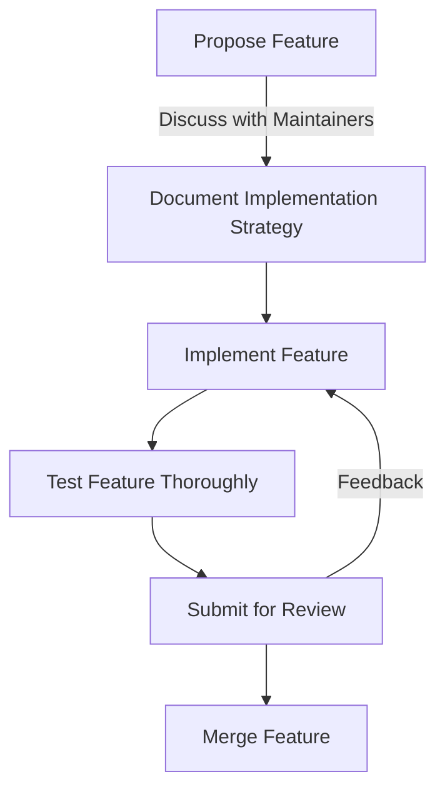

import { Callout, Steps, Step } from "nextra-theme-docs";

# Contributing to the Project

The **StratOptimus-TradingWizard** project thrives on community collaboration. We welcome contributions that enhance the project's functionality, documentation, and overall quality. Here's a guide to help you navigate the contribution process.

<Callout>
Contributions are reviewed to ensure consistency with the project's standards and objectives. Please adhere to the guidelines below to streamline this process and ensure a smooth integration of your contributions.
</Callout>

## Setting Up Your Environment

Before you start contributing, you need to set up a development environment conducive to productive contribution.

<Steps>

### Step 1: Fork the Repository

- Navigate to the [StratOptimus-TradingWizard GitHub repository](https://github.com/yourusername/best_trading_strategy.git).
- Click the **Fork** button to create your own copy of the repository.

### Step 2: Clone Your Fork

Clone the repository to your local machine using the following command:

```bash
git clone https://github.com/yourusername/best_trading_strategy.git
cd best_trading_strategy
```

### Step 3: Create a Virtual Environment

Set up a Python virtual environment to manage dependencies:

```bash
python3 -m venv venv
source venv/bin/activate
```

### Step 4: Install Dependencies

Use the `requirements.txt` to install necessary dependencies:

```bash
pip install -r requirements.txt
```

</Steps>

## Implementing Your Changes

Once your environment is set up, you can begin making changes or add features to the project.

### Coding Standards and Best Practices

- **Follow PEP 8:** Ensure your code adheres to Python's PEP 8 standards for code formatting.
- **Functionality Documentation:** Use descriptive docstrings for all functions and modules, adhering to PEP 257.
  
## Contributing a New Feature

If you wish to add a new feature, it's essential to map out the implementation strategy and consult with the maintainers if necessary. Here's a high-level flowchart illustrating the typical feature addition process:



## Submitting a Contribution

<Steps>

### Step 1: Create a Feature Branch

Create a new branch for your feature or bug fix:

```bash
git checkout -b feature/your-feature-name
```

### Step 2: Implement and Test

- Implement your changes.
- Run tests using `pytest` to validate your changes:

```bash
pytest
```

### Step 3: Commit Your Changes

Commit your changes with descriptive messages:

```bash
git commit -m "Add detailed feature for X"
```

### Step 4: Push to Your Fork

```bash
git push origin feature/your-feature-name
```

### Step 5: Submit a Pull Request

Navigate to the repository's page and create a pull request from your feature branch. Provide a clear description and link to any related issues.

</Steps>

## Code Review Process

All contributions undergo a code review to ensure alignment with the project's standards.

- **Feedback Loop**: Address feedback promptly and revise your code if needed.
- **Discussion**: Engage in discussions on the pull request page if clarifications are needed.

## Helpful Links

- [Installation and Usage](/installation-usage)
- [Development Process and Best Practices](/development-process-best-practices)

By following these guidelines, you contribute to a robust and dynamic trading strategy project that benefits the entire community.