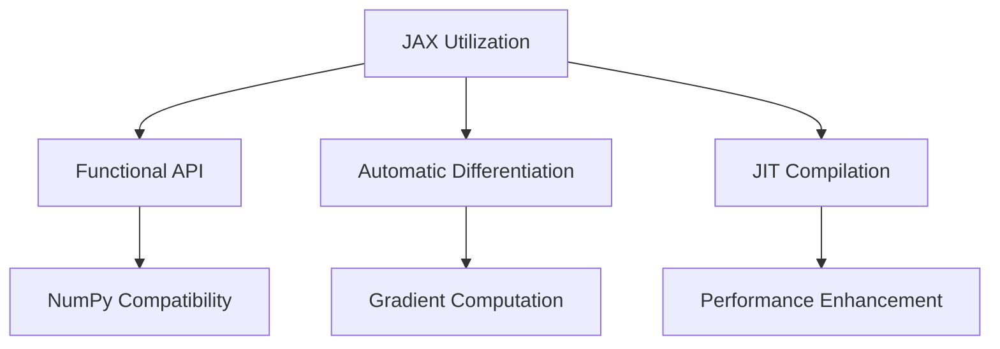

# Development Process and Best Practices

The **StratOptimus-TradingWizard** project is developed with a structured methodology that adheres to best practices aimed at ensuring code quality, efficiency, and maintainability. This section provides an overview of the development processes, highlighting key practices that contribute to the project's success.

## Overview of the Development Process

The project employs an iterative development approach, allowing for continuous improvement and alignment with its objectives. This methodology is central to adapting quickly to new insights and changing requirements, particularly in the dynamic field of trading strategy development.

<Callout type="info">
This iterative approach permits ongoing alignment with real-world market conditions, ensuring trading strategies remain effective and responsive.
</Callout>

### Iterative Development Steps

<Steps>

### Step 1: Requirement Gathering

- Begin by utilizing the **WritePRD** action to define and refine project requirements.
- Collect input from stakeholders and market analysis to establish clear, actionable objectives.

### Step 2: System Design

- Employ the **WriteDesign** action to create a robust system architecture.
- Outline data flows, module interactions, and technical specifications.

### Step 3: Implementation

- Use the **WriteCode** action to implement the trading strategy and supporting modules.
- Adhere to best coding practices, ensuring code quality and maintainability.

### Step 4: Code Review

- Leverage the **WriteCodeReview** action to conduct thorough code reviews.
- Ensure compliance with design specifications and identify areas for optimization.

### Step 5: Testing

- Implement comprehensive tests using the **WriteTest** action.
- Validate the correctness, performance, and reliability of the trading algorithms.

### Step 6: Research and Improvement

- Continuously research and refine strategies using the **Research** action.
- Incorporate the latest advancements in machine learning and financial analysis to enhance strategy effectiveness.

### Step 7: Optimization

- Optimize trading parameters using prompts defined in the trading workflows.
- Conduct backtesting and adjust strategies based on performance metrics.

</Steps>

## Best Practices

Adhering to industry-standard best practices is paramount to the success of the StratOptimus-TradingWizard project. Below are some critical areas that facilitate robust development and scalable architectures.

### [Code Style and Structure](/development-process-best-practices/code-style-structure)

A consistent code style ensures clarity and uniformity across the codebase. The project emphasizes the following aspects:

- **Conciseness and Clarity**: Writing concise, technical Python code with accurate examples. Avoiding unnecessary verbosity.
- **Modular Design**: Organizing code into functions and modules for clarity and reusability.
- **Descriptive Naming**: Utilizing descriptive variable names to enhance readability.

### [JAX Best Practices](/development-process-best-practices/jax-best-practices)

JAX is a powerful tool that enhances our computational efficiency. Here’s how we utilize it effectively:

### [Error Handling and Validation](/development-process-best-practices/error-handling-validation)

Ensuring robust error handling and validation protocols is critical to maintain system stability. Some key practices include:

- **Input Validation**: Ensuring data integrity by validating input shapes and data types.
- **Graceful Handling**: Utilizing exceptions and assertions effectively for error reporting.

<Callout type="warning">
Implementing solid error handling protects the system against unexpected market data anomalies.
</Callout>

### [Asynchronous Programming](/development-process-best-practices/asynchronous-programming)

The project leverages asynchronous programming to enhance performance and scalability, especially during optimization runs.

- **Async Functions**: Utilize `async def` for functions that involve I/O-bound operations or can benefit from concurrency.
- **Concurrency Management**: Manage concurrent tasks efficiently using `asyncio`, ensuring optimal resource utilization.
- **Error Propagation**: Properly handle exceptions within asynchronous contexts to maintain application stability.

### [Configuration Management](/development-process-best-practices/configuration-management)

Effective management of configuration settings is crucial for adaptability and security.

- **Environment Variables**: Store sensitive information such as API keys and database credentials in environment variables using libraries like `dotenv`.
- **YAML Configuration Files**: Use YAML files for defining and managing project settings, enabling easy modifications and environment-specific configurations.
- **Dynamic Configuration Loading**: Implement functions to dynamically load and validate configuration settings at runtime.

### [Logging Practices](/development-process-best-practices/logging-practices)

Comprehensive logging is essential for monitoring, debugging, and maintaining the application.

- **Structured Logging**: Use consistent logging formats to capture timestamps, log levels, and messages.
- **Log Levels**: Utilize appropriate log levels (`INFO`, `WARNING`, `ERROR`, etc.) to categorize log messages effectively.
- **Error Logging**: Ensure that all exceptions and critical errors are logged with sufficient detail for troubleshooting.

### [Asynchronous Optimization Processes](/development-process-best-practices/asynchronous-optimization-processes)

- **Parallel Evaluations**: Implement parallel evaluations during optimization to expedite performance using parameters like `parallel_evaluations`.
- **Concurrency Control**: Manage the number of concurrent tasks to prevent resource exhaustion and ensure system responsiveness.

## Conclusion

The **StratOptimus-TradingWizard** project thrives on clearly defined processes and well-established practices. By adhering to these guidelines, we ensure the delivery of high-performance, reliable trading strategies that effectively respond to the demands of the financial markets. For more detailed guidelines on specific areas, refer to the respective subsections: [Code Style and Structure](/development-process-best-practices/code-style-structure), [JAX Best Practices](/development-process-best-practices/jax-best-practices), [Error Handling and Validation](/development-process-best-practices/error-handling-validation), [Asynchronous Programming](/development-process-best-practices/asynchronous-programming), [Configuration Management](/development-process-best-practices/configuration-management), and [Logging Practices](/development-process-best-practices/logging-practices).
