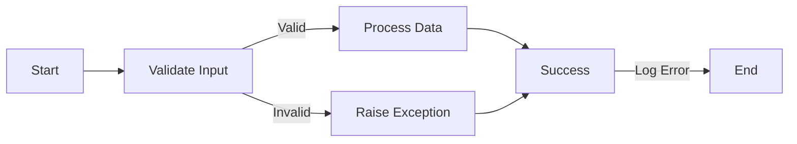

import { Callout, Steps, Step } from "nextra-theme-docs";

# Error Handling and Validation

Effective error handling and validation are crucial components in maintaining the robustness, stability, and reliability of the **StratOptimus-TradingWizard** project. By ensuring data integrity and managing errors gracefully, the risk of runtime issues and operational deficiencies is significantly reduced.

## Input Validation

### Importance of Input Validation

*Input validation* is a fundamental practice that ensures all data entering the system is appropriate and correctly formatted. This serves as a first line of defense against errors and potential exploits.

- **Shape Checks**: Ensure that input data conforms to expected dimensions and formats.
- **Data Type Verification**: Confirm that inputs are of the correct data types, such as integers or floats.

<Callout>
Always validate inputs at the earliest point in your functions to catch errors early and ensure reliable data processing.
</Callout>

## Error Handling

### Principles of Robust Error Handling

Robust error handling prevents crashes and ensures the system's continued operation in unexpected scenarios. It's crucial to provide informative feedback and maintain application stability.

- **Use Assertions**: Employ assertions to check conditions that must hold true for code to execute correctly. For example:

  ```python
  assert isinstance(data, np.ndarray), "Input must be a NumPy array"
  ```

- **Exception Handling**: Utilize `try-except` blocks to manage exceptions and provide meaningful error messages:

  ```python
  try:
      result = compute_risk_metrics(data)
  except ValueError as e:
      print(f"Value error encountered: {e}")
  ```

### Steps for Exception Management

<Steps>
### Step 1: Identify Critical Sections

Identify parts of the code where errors are likely to occur, such as input handling, data processing, and external API calls.

### Step 2: Implement Assertions

Use assertions for conditions that must always be true. This acts as a sanity check during development.

### Step 3: Use Try-Except Blocks

Wrap critical sections with `try-except` blocks to catch and handle exceptions gracefully.

### Step 4: Log Errors

Implement logging to record errors for further diagnosis and historical tracking.
</Steps>

## Informative Error Messaging

### Crafting Useful Error Messages

Creating informative error messages can drastically improve troubleshooting by providing context and guidance on resolving issues.

- **Clarity**: Ensure messages are clear and descriptive, highlighting the nature and location of the error.
- **Actionable Feedback**: Provide suggestions for correcting the issue or steps to investigate further.

## Diagram: Error Handling Process



<Callout>
Error handling is an ongoing process. Ensure to update your error messages and handling mechanisms alongside project development.
</Callout>

## Conclusion

For more details on best practices in the development process, including error handling and validation, refer to the [Development Process and Best Practices section](/development-process-best-practices).

This structured approach to error handling and validation not only enhances the reliability of the trading strategies but also contributes to a robust and user-friendly system.