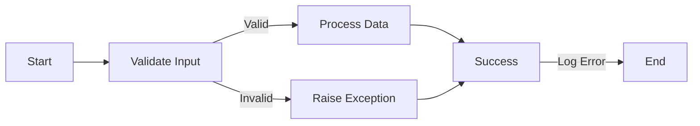

# Error Handling and Validation

Effective error handling and validation are crucial components in maintaining the robustness, stability, and reliability of the **StratOptimus-TradingWizard** project. By ensuring data integrity and managing errors gracefully, the risk of runtime issues and operational deficiencies is significantly reduced.

## Input Validation

### Importance of Input Validation

*Input validation* is a fundamental practice that ensures all data entering the system is appropriate and correctly formatted. This serves as a first line of defense against errors and potential exploits.

- **Shape Checks**: Ensure that input data conforms to expected dimensions and formats.
- **Data Type Verification**: Confirm that inputs are of the correct data types, such as integers or floats.

<Callout>
Always validate inputs at the earliest point in your functions to catch errors early and ensure reliable data processing.
</Callout>

## Error Handling

### Principles of Robust Error Handling

Robust error handling prevents crashes and ensures the system's continued operation in unexpected scenarios. It's crucial to provide informative feedback and maintain application stability.

- **Use Assertions**: Employ assertions to check conditions that must hold true for code to execute correctly. For example:

  ```python
  assert isinstance(data, np.ndarray), "Input must be a NumPy array"
  ```

- **Exception Handling**: Utilize `try-except` blocks to manage exceptions and provide meaningful error messages:

  ```python
  try:
      result = compute_risk_metrics(data)
  except ValueError as e:
      logger.error(f"Value error encountered: {e}")
  ```

- **Logging Configuration**: Set up comprehensive logging to capture detailed information about the application's execution and any errors that occur.

  ```python
  import logging
  import sys

  # Set up logging configuration
  logging.basicConfig(
      level=logging.DEBUG,  # Set to DEBUG to capture all levels of logs
      format="%(asctime)s - %(name)s - %(levelname)s - %(message)s",
      handlers=[
          logging.FileHandler("workflow_errors.log"),
          logging.StreamHandler(sys.stdout)
      ]
  )
  logger = logging.getLogger(__name__)
  ```

  - **FileHandler**: Logs are written to a file (`workflow_errors.log`) for persistent storage and later analysis.
  - **StreamHandler**: Logs are also output to the console (`stdout`) for real-time monitoring.

### Steps for Exception Management

<Steps>
### Step 1: Identify Critical Sections

Identify parts of the code where errors are likely to occur, such as input handling, data processing, and external API calls.

### Step 2: Implement Assertions

Use assertions for conditions that must always be true. This acts as a sanity check during development.

### Step 3: Use Try-Except Blocks

Wrap critical sections with `try-except` blocks to catch and handle exceptions gracefully.

### Step 4: Log Errors

Implement logging to record errors for further diagnosis and historical tracking.
</Steps>

## Informative Error Messaging

### Crafting Useful Error Messages

Creating informative error messages can drastically improve troubleshooting by providing context and guidance on resolving issues.

- **Clarity**: Ensure messages are clear and descriptive, highlighting the nature and location of the error.
- **Actionable Feedback**: Provide suggestions for correcting the issue or steps to investigate further.

Example:

```python
try:
    trading_data = load_trade_data("big_optimize_1016.pkl")
    if trading_data is None:
        raise FileNotFoundError("Trading data file 'big_optimize_1016.pkl' not found.")
except FileNotFoundError as e:
    logger.error(f"File not found error: {e}")
    # Handle the error or re-raise if necessary
```

## Advanced Logging Practices

### Multiple Handlers and Log Levels

Utilize multiple handlers to direct logs to different destinations with varying levels of importance.

```python
import logging
import sys

# Create a custom logger
logger = logging.getLogger(__name__)
logger.setLevel(logging.DEBUG)

# Create handlers
file_handler = logging.FileHandler('workflow_errors.log')
file_handler.setLevel(logging.ERROR)

stream_handler = logging.StreamHandler(sys.stdout)
stream_handler.setLevel(logging.DEBUG)

# Create formatters and add them to handlers
formatter = logging.Formatter('%(asctime)s - %(name)s - %(levelname)s - %(message)s')
file_handler.setFormatter(formatter)
stream_handler.setFormatter(formatter)

# Add handlers to the logger
logger.addHandler(file_handler)
logger.addHandler(stream_handler)
```

- **FileHandler**: Captures only ERROR level logs and above, directing them to a log file.
- **StreamHandler**: Captures DEBUG level logs and above, displaying them in the console.

### Asynchronous Logging

When working with asynchronous code, ensure that logging does not become a bottleneck.

```python
import logging
import asyncio

# Configure logging as shown above

async def process_data(data):
    try:
        # Processing logic
        logger.debug("Processing data started.")
        await asyncio.sleep(1)  # Simulate async operation
        if not isinstance(data, dict):
            raise TypeError("Data must be a dictionary.")
        logger.debug("Processing data completed successfully.")
    except Exception as e:
        logger.error(f"An error occurred during data processing: {e}", exc_info=True)

async def main():
    await process_data({"key": "value"})
    await process_data(["invalid", "data"])

if __name__ == "__main__":
    asyncio.run(main())
```

- **exc_info=True**: Captures the traceback information, providing detailed context for the error.

## Diagram: Error Handling Process



<Callout>
Error handling is an ongoing process. Ensure to update your error messages and handling mechanisms alongside project development.
</Callout>

## Conclusion

For more details on best practices in the development process, including error handling and validation, refer to the [Development Process and Best Practices section](/development-process-best-practices).

This structured approach to error handling and validation not only enhances the reliability of the trading strategies but also contributes to a robust and user-friendly system.
