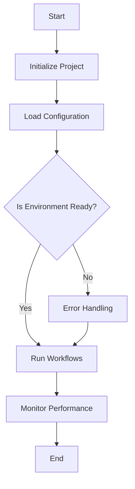

import { Callout, Steps, Step } from "nextra-theme-docs";

# Documentation and User Guides

Comprehensive documentation and well-structured user guides are crucial for ensuring that users can fully leverage the capabilities of the **StratOptimus-TradingWizard** project. This section provides detailed guidance on documentation strategies, user guide preparation, and example usage to facilitate seamless project comprehension and usage.

## Living Documentation

Maintaining up-to-date documentation is essential for capturing the latest project developments and ensuring that all stakeholders have accurate information. The documentation should evolve alongside the project, capturing new features, changes, and bug fixes.

### Key Elements

- **Readability**: Use clear and simple language to make documentation accessible to all stakeholders.
- **Structure**: Organize content logically, with a clear hierarchy of headings and subheadings.
- **Examples**: Provide practical examples to illustrate concepts and facilitate learning.

<Callout>
**Tip:** Regularly review and update the documentation to reflect any codebase changes or new features.
</Callout>

## Guide Structuring

Structuring user guides effectively ensures that users can easily navigate and understand how to use the various components of the project.

### Recommended Structure

- **Introduction**: Briefly introduce the project and its primary objectives.
- **Installation**: Step-by-step instructions for setting up the project on different platforms.
- **Features**: Detailed descriptions of key features and how to use them.
- **Best Practices**: Tips and guidelines for effective project utilization.
- **FAQs**: Answers to common questions and troubleshooting advice.

<Steps>
### Step 1

**Outline Key Sections**: Begin by outlining the key sections to cover in your guide, ensuring comprehensive coverage of all aspects of the project.

### Step 2

**Detail Each Section**: Provide detailed explanations, screenshots, and examples for each section, guiding users through the functionalities and use cases.
</Steps>

## Example Usage

Providing examples in the documentation allows users to see practical applications of the project's features, facilitating better understanding and adoption.

### Simple Usage Example

Consider this basic example of how to execute a predefined workflow:

```bash
python -m workflows.run_workflow --name initial_strategy_development
```

For a detailed explanation of each parameter and additional usage scenarios, please refer to the [Installation and Usage](/installation-usage) section.

## Diagrammatic Representations

Visual aids like diagrams can significantly enhance comprehension. Use **mermaid diagrams** to visually represent workflows and processes within the project.



<Callout>
**Note:** Visual representations can simplify complex processes, helping users quickly grasp the overall workflow and interactions.
</Callout>

## Additional Resources

Ensure the documentation includes links to additional resources to further aid users in understanding and utilizing the project.

- [Introduction to StratOptimus-TradingWizard](/)
- [Project Configuration](/project-configuration)
- [Testing and Debugging](/testing-debugging)

In conclusion, effective documentation and user guides are indispensable tools that empower users to make the most out of the **StratOptimus-TradingWizard** project. By focusing on clarity, structure, and practical examples, we can create resources that enhance user engagement and overall project success.