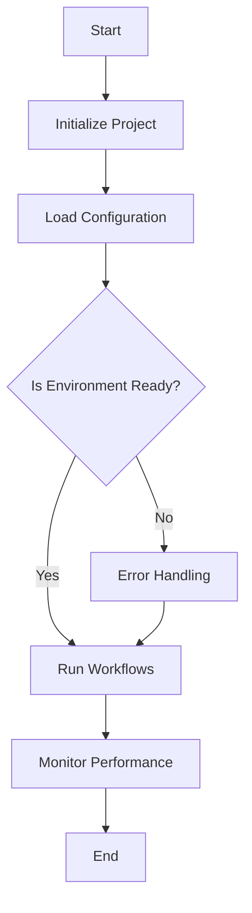

# Documentation and User Guides

Comprehensive documentation and well-structured user guides are crucial for ensuring that users can fully leverage the capabilities of the **StratOptimus-TradingWizard** project. This section provides detailed guidance on documentation strategies, user guide preparation, and example usage to facilitate seamless project comprehension and usage.

## Living Documentation

Maintaining up-to-date documentation is essential for capturing the latest project developments and ensuring that all stakeholders have accurate information. The documentation should evolve alongside the project, capturing new features, changes, and bug fixes.

### Key Elements

- **Readability**: Use clear and simple language to make documentation accessible to all stakeholders.
- **Structure**: Organize content logically, with a clear hierarchy of headings and subheadings.
- **Examples**: Provide practical examples to illustrate concepts and facilitate learning.

<Callout>
**Tip:** Regularly review and update the documentation to reflect any codebase changes or new features.
</Callout>

## Guide Structuring

Structuring user guides effectively ensures that users can easily navigate and understand how to use the various components of the project.

### Recommended Structure

- **Introduction**: Briefly introduce the project and its primary objectives.
- **Installation**: Step-by-step instructions for setting up the project on different platforms.
- **Configuration**: Detailed guidance on configuring the project, including key parameters and customization options.
- **Features**: Detailed descriptions of key features and how to use them.
- **Best Practices**: Tips and guidelines for effective project utilization.
- **FAQs**: Answers to common questions and troubleshooting advice.

<Steps>
### Step 1

**Outline Key Sections**: Begin by outlining the key sections to cover in your guide, ensuring comprehensive coverage of all aspects of the project.

### Step 2

**Detail Each Section**: Provide detailed explanations, screenshots, and examples for each section, guiding users through the functionalities and use cases.
</Steps>

## Configuration

Proper configuration is vital for tailoring the **StratOptimus-TradingWizard** to specific needs and optimizing its performance. This section outlines the essential configuration parameters and how to adjust them.

### Key Configuration Parameters

- **Initial Parameters**: Define the starting point for trading strategy optimization.
  
  ```json
  {
    "take_profit": 0.08,
    "stop_loss": 0.12,
    "sl_window": 400,
    "max_orders": 3,
    "post_buy_delay": 2,
    "post_sell_delay": 5,
    "macd_signal_fast": 120,
    "macd_signal_slow": 260,
    "macd_signal_signal": 90,
    "min_macd_signal_threshold": 0.0,
    "max_macd_signal_threshold": 0.0,
    "enable_sl_mod": false,
    "enable_tp_mod": false,
    "fees": 0.001
  }
  ```

  - **take_profit**: The percentage at which to take profit.
  - **stop_loss**: The percentage at which to stop loss.
  - **sl_window**: The window size for stop loss calculations.
  - **max_orders**: Maximum number of concurrent orders.
  - **post_buy_delay**: Delay after a buy order.
  - **post_sell_delay**: Delay after a sell order.
  - **macd_signal_fast**: Fast period for MACD signal.
  - **macd_signal_slow**: Slow period for MACD signal.
  - **macd_signal_signal**: Signal period for MACD.
  - **min_macd_signal_threshold**: Minimum threshold for MACD signal.
  - **max_macd_signal_threshold**: Maximum threshold for MACD signal.
  - **enable_sl_mod**: Enable modification of stop loss.
  - **enable_tp_mod**: Enable modification of take profit.
  - **fees**: Trading fees as a percentage.

### Updating Configuration

To update the configuration:

1. Locate the `trading_config.yaml` file in the `config` directory.
2. Modify the parameters as needed based on your optimization goals.
3. Ensure that all required parameters are set to avoid runtime errors.

## Example Usage

Providing examples in the documentation allows users to see practical applications of the project's features, facilitating better understanding and adoption.

### Simple Usage Example

Consider this basic example of how to execute a predefined workflow:

```bash
python -m workflows.run_workflow --name initial_strategy_development
```

### Running Optimization

To perform trading strategy optimization, use the `run_optimization.py` script. Ensure that the configuration file is correctly set up with all necessary parameters.

```bash
python Trading/run_optimization.py
```

**Example Command:**

```bash
python Trading/run_optimization.py
```

This command will:

1. Load the trading configuration from `config/trading_config.yaml`.
2. Initialize the LLM instance using the specified configuration.
3. Load trading data from the specified pickle file.
4. Execute recursive optimization using the initial parameters.
5. Save the best trading strategy to the designated output directory.

For more detailed explanations of each parameter and additional usage scenarios, please refer to the [Configuration](/configuration) section.

## Diagrammatic Representations

Visual aids like diagrams can significantly enhance comprehension. Use **mermaid diagrams** to visually represent workflows and processes within the project.



<Callout>
**Note:** Visual representations can simplify complex processes, helping users quickly grasp the overall workflow and interactions.
</Callout>

## Additional Resources

Ensure the documentation includes links to additional resources to further aid users in understanding and utilizing the project.

- [Introduction to StratOptimus-TradingWizard](/)
- [Project Configuration](/configuration)
- [Testing and Debugging](/testing-debugging)

In conclusion, effective documentation and user guides are indispensable tools that empower users to make the most out of the **StratOptimus-TradingWizard** project. By focusing on clarity, structure, and practical examples, we can create resources that enhance user engagement and overall project success.
