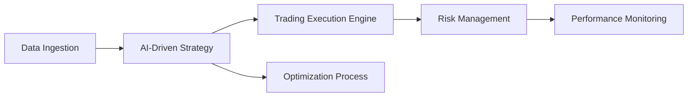

# Introduction

Welcome to the **StratOptimus-TradingWizard** project documentation. This initiative aims to revolutionize quantitative trading by leveraging advanced technologies such as **JAX**, **Python**, **NumPy**, and **Machine Learning**. The project integrates the **MetaGPT** framework, providing a powerful platform for developing, optimizing, and executing sophisticated trading strategies with high efficiency.

## Project Background

The financial markets have become increasingly complex and data-driven, necessitating the use of automated trading systems that can process vast amounts of data and respond to market changes in real-time. Our project addresses this need by offering a comprehensive solution that encompasses all stages of strategy development—from data ingestion to execution and optimization.

## Technologies Used

Here's a snapshot of the cutting-edge technologies employed in this project:

- **JAX:** Utilized for its efficient numerical computing capabilities, including just-in-time compilation and automatic differentiation.
- **Python:** The backbone of our project, chosen for its flexibility and extensive library ecosystem.
- **NumPy:** Provides robust numerical functions and array operations essential for data manipulation.
- **Machine Learning:** Integrated to enhance predictive analytics, adapt trading strategies, and optimize parameters.

These technologies work in synergy, enabling the development of robust and scalable trading strategies that capitalize on market opportunities.

## Project Objectives

The primary goals of the StratOptimus-TradingWizard project include:

- **AI-Driven Strategy Development:** Utilize machine learning algorithms to analyze financial data and derive actionable insights.
- **Workflow Automation with MetaGPT:** Streamline the creation, testing, and refinement of trading strategies through automated workflows.
- **Risk Management:** Implement mechanisms to assess and mitigate financial risks, ensuring sustainable trading practices.
- **High-Performance Computations:** Leverage JAX for complex data processing tasks, ensuring strategies remain nimble and efficient.

<Callout>
Our mission is to empower quantitative analysts, machine learning engineers, and traders with tools that harness the power of AI and high-performance computing.
</Callout>

## Overview Diagram

Below is a high-level view of the project architecture, showcasing the interconnection of core components.



Each component plays a vital role in ensuring the trading strategies are robust, adaptable, and profitable.

## Key Features

Let's explore some of the noteworthy features that set our project apart:

### AI-Driven Trading Strategies

We use sophisticated machine learning models to analyze both historical and real-time data, predicting trends with remarkable accuracy.

### Automated Workflow Management

Through the [MetaGPT Framework](/project-architecture/metagpt-framework-integration), we automate the workflow process, from strategy inception to execution and refinement, minimizing human error.

### Comprehensive Risk Management

Our risk management modules assess potential financial risks, ensuring trades are executed within predefined risk parameters. Learn more about these mechanisms in our [Risk Management](/project-architecture/machine-learning-models) section.

### Performance Optimization

Leveraging JAX's capabilities, our strategies undergo continuous refinement to enhance performance metrics like total returns and Sharpe ratio. Discover more about our performance strategies in [JAX and High-Performance Computing](/project-architecture/jax-high-performance-computing).

### Asynchronous Optimization and Parallel Evaluations

Our optimization workflows are designed to execute asynchronously, allowing for non-blocking operations and improved efficiency. By incorporating parallel evaluations, we can explore multiple strategy parameters simultaneously, significantly reducing optimization time.

### Robust Backtesting with VectorBTPro

We utilize **VectorBTPro** for comprehensive backtesting of trading strategies. This integration ensures that our strategies are rigorously tested against historical data, providing reliable performance metrics and insights.

### Efficient Output Management

All optimization results are systematically stored in timestamped directories, ensuring organized and traceable records of each optimization run. The best-performing strategies are saved in JSON format for easy retrieval and implementation.

### Advanced Error Handling and Logging

Our system includes robust error handling mechanisms that log detailed error information, facilitating quick diagnosis and resolution. This ensures the stability and reliability of the trading workflows.

### Example Usage

Providing examples in the documentation allows users to see practical applications of the project's features, facilitating better understanding and adoption.

#### Simple Usage Example

Consider this basic example of how to execute a predefined workflow:

```bash
python -m workflows.run_workflow --name initial_strategy_development
```

For a detailed explanation of each parameter and additional usage scenarios, please refer to the [Installation and Usage](/installation-usage) section.

## Overview of Optimization Workflow

The optimization workflow is a cornerstone of the **StratOptimus-TradingWizard** project, enabling the continuous improvement of trading strategies through systematic parameter tuning and performance evaluation.

### Workflow Components

- **Run Optimization Script (`run_optimization.py`):** Orchestrates the optimization process, loading configurations, initializing the LLM instance, and managing the optimization iterations.
  
- **Trading Workflow (`graph.py`):** Defines the workflow classes responsible for optimizing strategy parameters and evaluating performance using backtesting results.

### Optimization Process Steps

1. **Configuration Loading:** The system loads the trading configuration, including initial parameters and optimization settings from a YAML file.
   
2. **LLM Initialization:** An instance of the Language Model (LLM) is created based on the provided configuration, enabling AI-driven decision-making within the workflows.
   
3. **Data Loading:** Trading data is loaded using **VectorBTPro**, ensuring that the backtesting is performed on accurate and comprehensive datasets.
   
4. **Recursive Optimization:** The optimization process leverages asynchronous execution and parallel evaluations to explore multiple strategy parameters concurrently, enhancing efficiency and effectiveness.
   
5. **Performance Evaluation:** Optimized parameters are evaluated using backtesting to assess their impact on key performance metrics such as total return, Sharpe ratio, and maximum drawdown.
   
6. **Result Management:** The best-performing strategies are saved in a structured and timestamped output directory for easy access and implementation.

### Example Optimization Workflow Execution

```python
import asyncio
from workflows.run_optimization import main

if __name__ == "__main__":
    asyncio.run(main())
```

This example demonstrates how to initiate the optimization workflow, triggering the asynchronous execution of parameter tuning and performance evaluation.

<Callout>
By integrating asynchronous processes and advanced backtesting, our optimization workflow ensures that trading strategies are both robust and adaptable to changing market conditions.
</Callout>

## Additional Resources

Ensure the documentation includes links to additional resources to further aid users in understanding and utilizing the project.

- [Introduction to StratOptimus-TradingWizard](/)
- [Project Configuration](/project-configuration)
- [Testing and Debugging](/testing-debugging)

In conclusion, effective documentation and user guides are indispensable tools that empower users to make the most out of the **StratOptimus-TradingWizard** project. By focusing on clarity, structure, and practical examples, we can create resources that enhance user engagement and overall project success.
