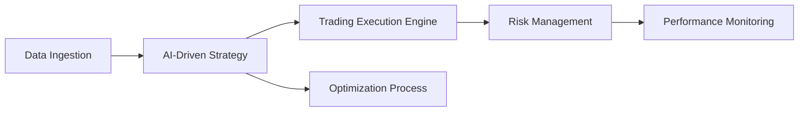

import { Callout, Steps, Step } from "nextra-theme-docs";

# Introduction

Welcome to the **StratOptimus-TradingWizard** project documentation. This initiative aims to revolutionize quantitative trading by leveraging advanced technologies such as **JAX**, **Python**, **NumPy**, and **Machine Learning**. The project integrates the **MetaGPT** framework, providing a powerful platform for developing, optimizing, and executing sophisticated trading strategies with high efficiency.

## Project Background

The financial markets have become increasingly complex and data-driven, necessitating the use of automated trading systems that can process vast amounts of data and respond to market changes in real-time. Our project addresses this need by offering a comprehensive solution that encompasses all stages of strategy development—from data ingestion to execution and optimization.

## Technologies Used

Here's a snapshot of the cutting-edge technologies employed in this project:

- **JAX:** Utilized for its efficient numerical computing capabilities, including just-in-time compilation and automatic differentiation.
- **Python:** The backbone of our project, chosen for its flexibility and extensive library ecosystem.
- **NumPy:** Provides robust numerical functions and array operations essential for data manipulation.
- **Machine Learning:** Integrated to enhance predictive analytics, adapt trading strategies, and optimize parameters.

These technologies work in synergy, enabling the development of robust and scalable trading strategies that capitalize on market opportunities.

## Project Objectives

The primary goals of the StratOptimus-TradingWizard project include:

- **AI-Driven Strategy Development:** Utilize machine learning algorithms to analyze financial data and derive actionable insights.
- **Workflow Automation with MetaGPT:** Streamline the creation, testing, and refinement of trading strategies through automated workflows.
- **Risk Management:** Implement mechanisms to assess and mitigate financial risks, ensuring sustainable trading practices.
- **High-Performance Computations:** Leverage JAX for complex data processing tasks, ensuring strategies remain nimble and efficient.

<Callout>
Our mission is to empower quantitative analysts, machine learning engineers, and traders with tools that harness the power of AI and high-performance computing.
</Callout>

## Overview Diagram

Below is a high-level view of the project architecture, showcasing the interconnection of core components.

Each component plays a vital role in ensuring the trading strategies are robust, adaptable, and profitable.

## Key Features

Let's explore some of the noteworthy features that set our project apart:

### AI-Driven Trading Strategies

We use sophisticated machine learning models to analyze both historical and real-time data, predicting trends with remarkable accuracy.

### Automated Workflow Management

Through the [MetaGPT Framework](/project-architecture/metagpt-framework-integration), we automate the workflow process, from strategy inception to execution and refinement, minimizing human error.

### Comprehensive Risk Management

Our risk management modules assess potential financial risks, ensuring trades are executed within predefined risk parameters. Learn more about these mechanisms in our [Risk Management](/project-architecture/machine-learning-models) section.

### Performance Optimization

Leveraging JAX's capabilities, our strategies undergo continuous refinement to enhance performance metrics like total returns and Sharpe ratio. Discover more about our performance strategies in [JAX and High-Performance Computing](/project-architecture/jax-high-performance-computing).

This introduction showcases the project's core aspects, setting the stage for an immersive dive into creating exceptional trading strategies. Explore more about our architecture and components in the subsequent sections.