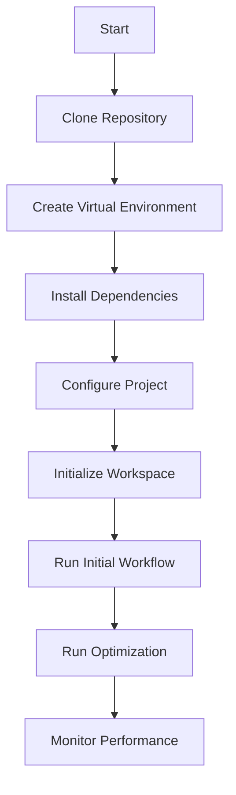

# Installation and Usage

Welcome to the installation and usage guide for the **StratOptimus-TradingWizard** project. This section will walk you through setting up the project on your local machine and provide steps to effectively utilize its powerful features.

## Prerequisites

Before beginning the installation, make sure you have the following prerequisites in place:

- **Python 3.7 or higher** installed on your machine.
- **Git** for cloning the repository.
- A **virtual environment** tool like `venv`.
  
<Callout>

**Note:** It is recommended to use a virtual environment to manage dependencies and avoid conflicts with other projects.

</Callout>

## Installation

The installation process can be broken down into a few simple steps:

<Steps>

### Step 1: Clone the Repository

Start by cloning the repository from GitHub to your local machine:

```bash
git clone https://github.com/yourusername/best_trading_strategy.git
cd best_trading_strategy
```

### Step 2: Create a Virtual Environment

Create and activate a virtual environment to isolate your project dependencies:

```bash
python3 -m venv venv
source venv/bin/activate
```

For Windows users, activate the virtual environment with:

```bash
.\venv\Scripts\activate
```

### Step 3: Install Dependencies

Install the required packages listed in `requirements.txt`:

```bash
pip install -r requirements.txt
```

<Callout>

**Ensure** that `requirements.txt` includes necessary packages like `jax`, `numpy`, `metagpt`, `pytest`, `vectorbtpro`, and `python-dotenv`.

</Callout>

### Step 4: Set Up Configuration

Configure the project by editing the `config/trading_config.yaml` file and setting up environment variables.

#### Edit Configuration File

Open the `config/trading_config.yaml` file and update it as needed:

```yaml
trading_data_path: "trading_data/trading_data.pickle"
sample: 35
check_convergence: true
initial_round: 1
max_rounds: 45
convergence_threshold: 0.01

initial_params:
  take_profit: 0.08
  stop_loss: 0.12
  sl_window: 400
  max_orders: 3
  post_buy_delay: 2
  post_sell_delay: 5
  macd_signal_fast: 120
  macd_signal_slow: 260
  macd_signal_signal: 90
  min_macd_signal_threshold: 0.0
  max_macd_signal_threshold: 0.0
  enable_sl_mod: false
  enable_tp_mod: false
  ma_window: 20
  fees: 0.001

llm_config:
  model: "gpt-4"
  api_key: "your-api-key-here"
```

**Tip:** Adjust these parameters based on your specific requirements and experimentation plans.

#### Set Up Environment Variables

Create a `.env` file in the root directory of the project to store environment-specific variables. This file should include the following variables:

```env
TRADING_CONFIG_PATH=config/trading_config.yaml
API_KEY=your-api-key-here
```

**Steps to Create `.env` File:**

1. In the root directory of your project, create a new file named `.env`.
2. Open the `.env` file and add the necessary environment variables as shown above.
3. Replace `your-api-key-here` with your actual API key.

<Callout>

**Note:** Ensure that the `.env` file is listed in your `.gitignore` to prevent sensitive information from being committed to version control.

</Callout>

### Step 5: Initialize the Project Workspace

Run the **PrepareDocuments** action to initialize the project folder and set up necessary documentation:

```bash
python -m actions.prepare_documents
```

### Step 6: Run Initial Workflow

Execute the initial workflow to generate the base trading strategy:

```bash
python -m workflows.initialize_strategy
```

### Step 7: Run Optimization Workflow

To further optimize the trading strategy, execute the optimization workflow:

```bash
python Trading/run_optimization.py
```

This script will perform recursive optimization of your trading strategy parameters based on historical trading data.

</Steps>

## Usage

With the project set up, you can now leverage its powerful features to develop and optimize trading strategies.

### Running Workflows

Execute predefined workflows to manage different stages:

```bash
python -m workflows.run_workflow --name initial_strategy_development
```

*Replace `initial_strategy_development` with the desired workflow name, specified in [Workflows](/key-functional-components/workflows).*

### Executing Actions

Invoke specific actions for targeted tasks:

```bash
python -m actions.write_prd
```

Refer to [Actions](/key-functional-components/actions) for a comprehensive list of available actions.

### Monitoring Performance

Utilize integrated modules to monitor strategy effectiveness:

```bash
python -m trading.monitor_performance
```

Ensure trading data is prepared according to the details in [Data Ingestion and Processing](/project-architecture).

### Running Optimization

To run the trading strategy optimization, use the following command:

```bash
python Trading/run_optimization.py
```

This script will execute the recursive optimization process, adjusting strategy parameters to enhance performance based on historical trading data.

### Example Usage

Here is a basic example of how to execute a predefined workflow:

```bash
python -m workflows.run_workflow --name initial_strategy_development
```

For more detailed usage scenarios, refer to the [Installation and Usage](/installation-usage) section.

## Visualizing the Workflow

For a visual representation of how workflows are orchestrated, here's a simple `mermaid` diagram:



This diagram outlines the sequential steps to set up the project, execute workflows, optimize strategies, and monitor performance.

## Conclusion

By following these steps, you will have the **StratOptimus-TradingWizard** set up and ready for action. Whether you're a quantitative analyst, a machine learning engineer, or a tech enthusiast, this guide ensures you can tap into the project's capabilities and explore the power of AI-driven trading strategies. For any further inquiries, visit [Contact and Support](/contact-support) for assistance.

Happy trading!
