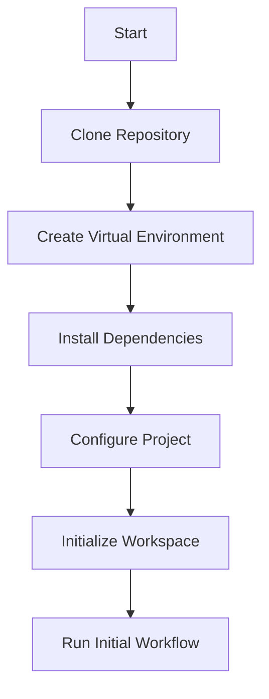

import { Callout, Steps, Step } from "nextra-theme-docs";

# Installation and Usage

Welcome to the installation and usage guide for the **StratOptimus-TradingWizard** project. This section will walk you through setting up the project on your local machine and provide steps to effectively utilize its powerful features.

## Prerequisites

Before beginning the installation, make sure you have the following prerequisites in place:

- **Python 3.7 or higher** installed on your machine.
- **Git** for cloning the repository.
- A **virtual environment** tool like `venv`.
  
<Callout>

**Note:** It is recommended to use a virtual environment to manage dependencies and avoid conflicts with other projects.

</Callout>

## Installation

The installation process can be broken down into a few simple steps:

<Steps>

### Step 1: Clone the Repository

Start by cloning the repository from GitHub to your local machine:

```bash
git clone https://github.com/yourusername/best_trading_strategy.git
cd best_trading_strategy
```

### Step 2: Create a Virtual Environment

Create and activate a virtual environment to isolate your project dependencies:

```bash
python3 -m venv venv
source venv/bin/activate
```

For Windows users, activate the virtual environment with:

```bash
.\venv\Scripts\activate
```

### Step 3: Install Dependencies

Install the required packages listed in `requirements.txt`:

```bash
pip install -r requirements.txt
```

<Callout>

**Ensure** that `requirements.txt` includes necessary packages like `jax`, `numpy`, `metagpt`, and `pytest`.

</Callout>

### Step 4: Set Up Configuration

Configure the project by editing the `.lumentis/wizard.json` configuration file as needed:

```json
{
    "model_selection": "jax_model_v1",
    "console_output": "verbose",
    "learning_rate": 0.001,
    "weights": [0.1, 0.2, 0.3],
    "gradients": "auto"
}
```

**Tip:** Adjust these parameters based on your specific requirements and experimentation plans.

### Step 5: Initialize the Project Workspace

Run the **PrepareDocuments** action to initialize the project folder and set up necessary documentation:

```bash
python -m actions.prepare_documents
```

### Step 6: Run Initial Workflow

Execute the initial workflow to generate the base trading strategy:

```bash
python -m workflows.initialize_strategy
```

</Steps>

## Usage

With the project set up, you can now leverage its powerful features to develop and optimize trading strategies.

### Running Workflows

Execute predefined workflows to manage different stages:

```bash
python -m workflows.run_workflow --name initial_strategy_development
```

*Replace `initial_strategy_development` with the desired workflow name, specified in [Workflows](/key-functional-components/workflows).*

### Executing Actions

Invoke specific actions for targeted tasks:

```bash
python -m actions.write_prd
```

Refer to [Actions](/key-functional-components/actions) for a comprehensive list of available actions.

### Monitoring Performance

Utilize integrated modules to monitor strategy effectiveness:

```bash
python -m trading.monitor_performance
```

Ensure trading data is prepared according to the details in [Data Ingestion and Processing](/project-architecture).

## Visualizing the Workflow

For a visual representation of how workflows are orchestrated, here's a simple `mermaid` diagram:



This diagram outlines the sequential steps to set up the project, offering a clear flow from start to utilization.

## Conclusion

By following these steps, you will have the **StratOptimus-TradingWizard** set up and ready for action. Whether you're a quantitative analyst, a machine learning engineer, or a tech enthusiast, this guide ensures you can tap into the project's capabilities and explore the power of AI-driven trading strategies. For any further inquiries, visit [Contact and Support](/contact-support) for assistance.

Happy trading!