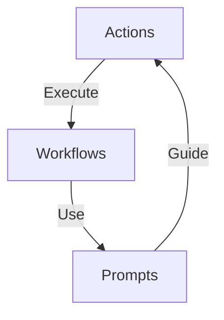

import { Callout, Steps, Step } from "nextra-theme-docs";

# Key Functional Components

The StratOptimus-TradingWizard project is structured around three core functional components: **Actions**, **Workflows**, and **Prompts**. These components orchestrate the automated development and optimization processes integral to our cutting-edge trading strategies.

## Overview

In this section, we explore how each component contributes to the project's success. Here's an overview of what we'll cover:

- **Actions**: The building blocks that encapsulate specific tasks within the workflow.  
- **Workflows**: Define the sequence and interaction of tasks, orchestrating the project lifecycle.  
- **Prompts**: Templates that guide AI tasks, ensuring accurate and consistent outputs.  

You can find more detailed information about each component by exploring the individual pages for [Actions](/key-functional-components/actions), [Workflows](/key-functional-components/workflows), and [Prompts](/key-functional-components/prompts).

## Core Components Diagram



This diagram illustrates the interaction between Actions, Workflows, and Prompts, showcasing how they create a cohesive ecosystem for automating and optimizing trading strategies.

## Interaction and Orchestration

Our components work together seamlessly to enable a dynamic and flexible project environment:

- **Actions**: Modular tasks that drive the workflow process. Each action is designed to perform a specific role, such as writing code or conducting a code review. Actions are versatile and reusable, enabling efficient workflow automation.  

- **Workflows**: Workflows manage the sequence of actions, defining how individual tasks interact to achieve comprehensive objectives such as strategy optimization or performance testing. They ensure consistency and coordination, automating complex processes with minimal manual intervention.

- **Prompts**: Crafted templates that guide AI tasks. Prompts ensure that actions produce accurate, relevant results by providing clear instructions and outlining expected outputs. Prompts enhance the effectiveness of the automated processes, crucial for refining trading strategies.

<Callout>
**Key Insight**: By integrating these components, StratOptimus-TradingWizard achieves high levels of automation, scalability, and efficiency, crucial for data-driven trading environments.
</Callout>

## Examples of Component Functionality

### Example 1: Writing a Product Requirement Document (PRD)

In this task, an **Action** is designated to create the PRD:

```plaintext
class WritePRD(Action):
    def execute(self, requirements):
        # Implementation for generating PRD
        pass
```

The **Workflow** defines how this Action interacts with others, such as reviewing PRD drafts:

```plaintext
workflow = Workflow(
    actions=[WritePRD(), ReviewPRD()]
)
```

**Prompts** guide the AI in executing these tasks, ensuring that requirements are accurately captured and articulated. 

### Example 2: Strategy Optimization

For optimizing a trading strategy, Actions might include data ingestion, model training, and parameter fine-tuning. The Workflow sequences these actions, while Prompts steer AI assessments on strategy adjustments.

## Scalability and Flexibility

The modular nature of Actions, Workflows, and Prompts enables the project to scale efficiently, adapting to expanding requirements or integrating new capabilities. These components ensure the project can evolve without significant rework, maintaining a robust and maintainable codebase.

Explore how these components drive the development process and best practices [here](/development-process-best-practices).

<Steps>
### Step 1: Define Actions

Identify and implement specific tasks for the project workflow.

### Step 2: Sequence Workflows

Organize the Actions to create efficient processes, ensuring strategic goals are met.

### Step 3: Implement Prompts

Develop and use prompts to guide AI tasks, ensuring outputs are accurate and relevant.
</Steps>

With the strategic integration of these components, the StratOptimus-TradingWizard project is equipped to develop, test, and optimize sophisticated trading strategies with remarkable efficiency and precision.