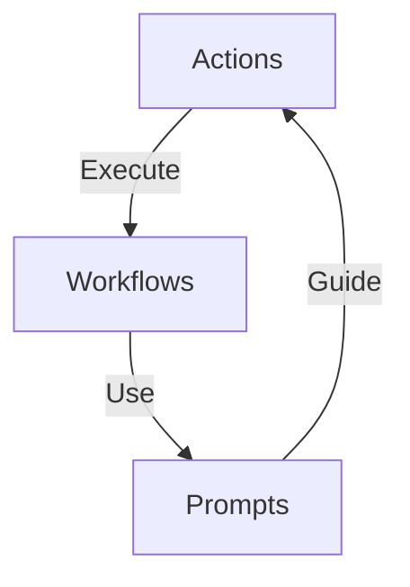

# Key Functional Components

The StratOptimus-TradingWizard project is structured around three core functional components: **Actions**, **Workflows**, and **Prompts**. These components orchestrate the automated development and optimization processes integral to our cutting-edge trading strategies.

## Overview

In this section, we explore how each component contributes to the project's success. Here's an overview of what we'll cover:

- **Actions**: The building blocks that encapsulate specific tasks within the workflow.  
- **Workflows**: Define the sequence and interaction of tasks, orchestrating the project lifecycle.  
- **Prompts**: Templates that guide AI tasks, ensuring accurate and consistent outputs.  

You can find more detailed information about each component by exploring the individual pages for [Actions](/key-functional-components/actions), [Workflows](/key-functional-components/workflows), and [Prompts](/key-functional-components/prompts).

## Core Components Diagram



This diagram illustrates the interaction between Actions, Workflows, and Prompts, showcasing how they create a cohesive ecosystem for automating and optimizing trading strategies.

## Interaction and Orchestration

Our components work together seamlessly to enable a dynamic and flexible project environment:

- **Actions**: Modular tasks that drive the workflow process. Each action is designed to perform a specific role, such as writing code or conducting a code review. Actions are versatile and reusable, enabling efficient workflow automation.  
    
- **Workflows**: Workflows manage the sequence of actions, defining how individual tasks interact to achieve comprehensive objectives such as strategy optimization or performance testing. They ensure consistency and coordination, automating complex processes with minimal manual intervention.

- **Prompts**: Crafted templates that guide AI tasks. Prompts ensure that actions produce accurate, relevant results by providing clear instructions and outlining expected outputs. Prompts enhance the effectiveness of the automated processes, crucial for refining trading strategies.

<Callout>
**Key Insight**: By integrating these components, StratOptimus-TradingWizard achieves high levels of automation, scalability, and efficiency, crucial for data-driven trading environments.
</Callout>

## Examples of Component Functionality

### Example 1: Writing a Product Requirement Document (PRD)

In this task, an **Action** is designated to create the PRD:

```plaintext
class WritePRD(Action):
    def execute(self, requirements):
        # Implementation for generating PRD
        pass
```

The **Workflow** defines how this Action interacts with others, such as reviewing PRD drafts:

```plaintext
workflow = Workflow(
    actions=[WritePRD(), ReviewPRD()]
)
```

**Prompts** guide the AI in executing these tasks, ensuring that requirements are accurately captured and articulated. 

### Example 2: Strategy Optimization

For optimizing a trading strategy, Actions might include data ingestion, model training, and parameter fine-tuning. The Workflow sequences these actions, while Prompts steer AI assessments on strategy adjustments.

### Example 3: Trading Strategy Optimization Workflow

The **Trading Workflow** is a comprehensive process that orchestrates the optimization of trading strategies using asynchronous operations and recursive optimization techniques. This workflow includes actions like loading trading data, performing backtests, and utilizing an LLM for parameter optimization.

**Action Example: Run Optimization**

```python:Trading/run_optimization.py
import asyncio
import logging
from typing import Dict, Any
import os
import json
from datetime import datetime
import sys
import vectorbtpro as vbt
from metagpt.configs.llm_config import LLMConfig
from metagpt.provider.llm_provider_registry import create_llm_instance
from scripts.config_utils import load_config
from scripts.optimized.Trading.recursive_optimization import recursive_optimization
from scripts.optimized.Trading.backtester_module import load_trade_data
from dotenv import load_dotenv

# Set up logging
logging.basicConfig(level=logging.INFO, format='%(asctime)s - %(levelname)s - %(message)s')
logger = logging.getLogger(__name__)

# Load environment variables from .env file
load_dotenv()

async def main():
    try:
        # Load configuration
        config = load_config(os.environ.get("TRADING_CONFIG_PATH", "config/trading_config.yaml"))
        
        # Create LLM instance
        llm_config = LLMConfig(**config["llm_config"])
        llm = create_llm_instance(llm_config)

        # Create output directory
        timestamp = datetime.now().strftime("%Y%m%d_%H%M%S")
        output_dir = f"output/trading_optimization_{timestamp}"
        os.makedirs(output_dir, exist_ok=True)
        
        # Load dataset
        dataset = config.get("dataset", [])
        
        # Define initial parameters
        initial_params = config.get("initial_params", {
            "take_profit": 0.08,
            "stop_loss": 0.12,
            "sl_window": 400,
            "max_orders": 3,
            "post_buy_delay": 2,
            "post_sell_delay": 5,
            "macd_signal_fast": 120,
            "macd_signal_slow": 260,
            "macd_signal_signal": 90,
            "min_macd_signal_threshold": 0.0,
            "max_macd_signal_threshold": 0.0,
            "enable_sl_mod": False,
            "enable_tp_mod": False,
            "ma_window": 20,
            "fees": 0.001
        })
        
        # Load or fetch trading data using the backtester's load_trade_data function
        trading_data = load_trade_data("big_optimize_1016.pkl")

        if trading_data is None:
            logger.error("Failed to load trading data. Please ensure the pickle file exists and is accessible.")
            return

        # Create a dataset with a subset of assets for optimization
        dataset = list(trading_data.keys())[:5]  # Use the first 5 assets for example
        
        # Run recursive optimization
        best_strategy, best_performance = await recursive_optimization(
            initial_params=initial_params,
            dataset=dataset,
            llm=llm,
            trading_data=trading_data,
            max_iterations=config.get("max_rounds", 45),
            convergence_threshold=config.get("convergence_threshold", 0.01),
            parallel_evaluations=config.get("parallel_evaluations", 5)
        )

        # Save the best strategy
        if best_strategy:
            with open(os.path.join(output_dir, "best_trading_strategy_final.json"), "w") as f:
                json.dump(best_strategy, f, indent=2)
            logger.info(f"Optimization completed. Best strategy saved to {output_dir}")
            logger.info(f"Best performance: {best_performance}")
        else:
            logger.error("Optimization failed.")

    except Exception as e:
        logger.error(f"An error occurred: {str(e)}")
        raise

if __name__ == "__main__":
    asyncio.run(main())
```

**Workflow Example: Trading Workflow**

```python:Trading/workflows/round_1/graph.py
from typing import Literal, Dict, Any, Tuple, List
from pydantic import BaseModel, Field
from metagpt.provider.llm_provider_registry import create_llm_instance
from metagpt.utils.cost_manager import CostManager
import sys
import os
import asyncio
import json
import vectorbtpro as vbt
import scripts.optimized.Trading.workflows.template.operator as operator
import scripts.optimized.Trading.workflows.round_1.prompt as prompt_custom
from scripts.optimized.Trading.workflows.template.operator import (
    get_parameter_optimizer,
    get_strategy_evaluator
)
import logging
import traceback

# Set up logging configuration
logging.basicConfig(
    level=logging.DEBUG,
    format="%(asctime)s - %(name)s - %(levelname)s - %(message)s",
    handlers=[
        logging.FileHandler("workflow_errors.log"),
        logging.StreamHandler(sys.stdout)
    ]
)
logger = logging.getLogger(__name__)

# Define Pydantic models for operator responses
class StrategyParameters(BaseModel):
    take_profit: float = Field(default=0.08, description="Take profit percentage")
    stop_loss: float = Field(default=0.12, description="Stop loss percentage")
    sl_window: int = Field(default=400, description="Stop loss window")
    max_orders: int = Field(default=3, description="Maximum number of concurrent orders")
    order_size: float = Field(default=0.0025, description="Order size as a ratio of SOL pool")
    post_buy_delay: int = Field(default=2, description="Delay after a buy order")
    post_sell_delay: int = Field(default=5, description="Delay after a sell order")
    macd_signal_fast: int = Field(default=120, description="MACD fast period")
    macd_signal_slow: int = Field(default=260, description="MACD slow period")
    macd_signal_signal: int = Field(default=90, description="MACD signal period")
    min_macd_signal_threshold: float = Field(default=0.0, description="Minimum MACD signal threshold")
    max_macd_signal_threshold: float = Field(default=0.0, description="Maximum MACD signal threshold")
    enable_sl_mod: bool = Field(default=False, description="Enable stop loss modification")
    enable_tp_mod: bool = Field(default=False, description="Enable take profit modification")

class BacktestResult(BaseModel):
    total_return: float = Field(default=0.0, description="Total return of the strategy")
    sharpe_ratio: float = Field(default=0.0, description="Sharpe ratio of the strategy")
    max_drawdown: float = Field(default=0.0, description="Maximum drawdown of the strategy")

DatasetType = Literal["HumanEval", "MBPP", "GSM8K", "MATH", "HotpotQA", "DROP", "Trading"]

class Workflow:
    def __init__(
        self,
        name: str,
        llm: Any,
        dataset: DatasetType,
    ) -> None:
        self.name = name
        self.dataset = dataset
        self.llm = llm
        self.llm.cost_manager = CostManager()
        self.custom = operator.Custom(self.llm)

    async def __call__(self, problem: str) -> Tuple[str, float]:
        """
        Implementation of the basic workflow

        Args:
            problem (str): The input problem to solve.

        Returns:
            Tuple[str, float]: The solution and the total cost.
        """
        solution = await self.custom(input=problem, instruction="")
        return solution['response'], self.llm.cost_manager.total_cost

class TradingWorkflow(Workflow):
    def __init__(
        self,
        name: str,
        llm: Any,
        dataset: DatasetType,
        trading_data: vbt.Portfolio
    ) -> None:
        super().__init__(name, llm, dataset)
        self.trading_data = trading_data
        self.parameter_optimizer = get_parameter_optimizer(self.llm)
        self.strategy_evaluator = get_strategy_evaluator(self.llm)

    async def execute_trading_workflow(
        self, initial_parameters: StrategyParameters
    ) -> Tuple[Dict[str, Any], float]:
        """
        Executes the trading strategy optimization workflow.

        Args:
            initial_parameters (StrategyParameters): The initial parameters for the trading strategy.

        Returns:
            Tuple[Dict[str, Any], float]: Evaluation results and total cost.
        """
        try:
            # Step 1: Optimize parameters
            optimized_params_response = await self.parameter_optimizer(
                initial_parameters=initial_parameters.dict(),
                trading_data=self.trading_data,
                instruction=prompt_custom.PARAMETER_OPTIMIZATION_PROMPT
            )
            logger.debug(f"Optimized parameters response: {optimized_params_response}")
            optimized_params = StrategyParameters(**self._ensure_dict(optimized_params_response))
            logger.debug(f"Parsed optimized parameters: {optimized_params}")

            # Step 2: Evaluate strategy
            backtest_result_response = await self.strategy_evaluator(
                parameters=optimized_params.dict(),
                trading_data=self.trading_data,
                instruction=prompt_custom.STRATEGY_EVALUATION_PROMPT
            )
            logger.debug(f"Backtest result response: {backtest_result_response}")
            backtest_result = BacktestResult(**self._ensure_dict(backtest_result_response))
            logger.debug(f"Parsed backtest result: {backtest_result}")

            evaluation_results = {
                "optimized_parameters": optimized_params.dict(),
                "backtest_results": backtest_result.dict()
            }

            logger.debug(f"Evaluation results: {evaluation_results}")

            return evaluation_results, self.llm.cost_manager.total_cost
        except Exception as e:
            logger.error(f"Error in execute_trading_workflow: {str(e)}")
            logger.error("Traceback:", exc_info=True)
            return {"error": str(e)}, 0.0

    async def __call__(self, initial_parameters: StrategyParameters) -> Tuple[Dict[str, Any], float]:
        """
        Overrides the basic workflow call method to execute the trading workflow.

        Args:
            initial_parameters (StrategyParameters): The initial parameters for the trading strategy.

        Returns:
            Tuple[Dict[str, Any], float]: Evaluation results and total cost.
        """
        return await self.execute_trading_workflow(initial_parameters)

    def _ensure_dict(self, obj: Any) -> Dict[str, Any]:
        """
        Ensures that the provided object is a dictionary.
        If it's a Pydantic model, convert it to a dict.
        If it's a list, convert each element.
        Otherwise, convert the object to a string.

        Args:
            obj (Any): The object to ensure is a dictionary.

        Returns:
            Dict[str, Any]: The standardized dictionary.
        """
        if isinstance(obj, dict):
            return {k: self._ensure_serializable(v) for k, v in obj.items()}
        elif hasattr(obj, 'dict'):
            return {k: self._ensure_serializable(v) for k, v in obj.dict().items()}
        elif isinstance(obj, list):
            return {f"item_{i}": self._ensure_serializable(item) for i, item in enumerate(obj)}
        else:
            return {"value": str(obj)}

    def _ensure_serializable(self, obj: Any) -> Any:
        """
        Recursively ensures that an object is JSON serializable.
        Converts non-serializable objects to strings.

        Args:
            obj (Any): The object to serialize.

        Returns:
            Any: The JSON serializable object.
        """
        if isinstance(obj, (str, int, float, bool, type(None))):
            return obj
        elif isinstance(obj, dict):
            return self._ensure_dict(obj)
        elif isinstance(obj, list):
            return [self._ensure_serializable(item) for item in obj]
        else:
            return str(obj)

# Example usage
if __name__ == "__main__":
    llm_config = {
        "model": "gpt-4",
        "api_key": "your-api-key-here"
    }

    # Initialize LLM instance
    llm = create_llm_instance(llm_config)

    # Load trading data (ensure the path is correct)
    trading_data = vbt.Portfolio.from_pickle("path/to/your/trading_data.pickle")

    # Initialize TradingWorkflow
    trading_workflow = TradingWorkflow(
        name="TradingStrategyOptimization",
        llm=llm,
        dataset="Trading",
        trading_data=trading_data
    )

    # Define initial strategy parameters
    initial_params = StrategyParameters(
        take_profit=0.05,
        stop_loss=0.03,
        sl_window=400,
        max_orders=3,
        post_buy_delay=2,
        post_sell_delay=5,
        macd_signal_fast=120,
        macd_signal_slow=260,
        macd_signal_signal=90,
        min_macd_signal_threshold=0.0,
        max_macd_signal_threshold=0.0,
        enable_sl_mod=False,
        enable_tp_mod=False
    )

    # Execute the workflow asynchronously
    async def execute_workflow():
        results, cost = await trading_workflow(initial_params)
        print(f"Optimization results: {results}")
        print(f"Total cost: {cost}")

    asyncio.run(execute_workflow())
```

## Scalability and Flexibility

The modular nature of Actions, Workflows, and Prompts enables the project to scale efficiently, adapting to expanding requirements or integrating new capabilities. These components ensure the project can evolve without significant rework, maintaining a robust and maintainable codebase.

Explore how these components drive the development process and best practices [here](/development-process-best-practices).

<Steps>
### Step 1: Define Actions

Identify and implement specific tasks for the project workflow.

### Step 2: Sequence Workflows

Organize the Actions to create efficient processes, ensuring strategic goals are met.

### Step 3: Implement Prompts

Develop and use prompts to guide AI tasks, ensuring outputs are accurate and relevant.
</Steps>

With the strategic integration of these components, the StratOptimus-TradingWizard project is equipped to develop, test, and optimize sophisticated trading strategies with remarkable efficiency and precision.
