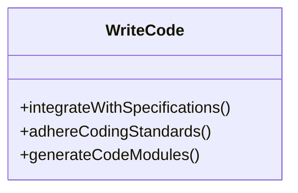

# Actions

In the **StratOptimus-TradingWizard** project, **Actions** are fundamental building blocks that encapsulate specific tasks and operations within the workflow automation framework. Each action is implemented as a Python class that inherits from `metagpt.actions.Action`. This modular approach facilitates high levels of reusability, maintainability, and scalability, allowing us to easily update or extend the system. Let's delve into the components that make up Actions and explore their significance.

## What Are Actions?

Actions are designed to perform individual tasks automatically, which contributes to the project’s overall strategy development and optimization processes. They ensure tasks are conducted efficiently and consistently across different stages of development.

<Callout>
Actions in the project help eliminate repetitive manual tasks, ensuring focus remains on strategic development.
</Callout>

## Key Action Scripts

Here's a breakdown of some critical action scripts, detailing their purpose and usage within the project.

### 1. WriteCode

The `WriteCode` action is responsible for the implementation of code based on predefined specifications and designs. It adheres to best coding practices, ensuring that the code is both robust and maintainable.



### 2. WriteCodeReview

This action conducts thorough code reviews. It provides constructive feedback and offers suggestions for improvements to ensure compliance with design specifications.

```python:actions/write_code_review.py
# Example and Instruction for WriteCodeReview
EXAMPLE_AND_INSTRUCTION = """
{format_example}

# Instruction: Based on the actual code, follow one of the "Code Review Format example".
- Note the code filename should be `{filename}`. Return the only ONE file `{filename}` under review.

## Code Review: Ordered List. Based on the "Code to be Reviewed", provide key, clear, concise, and specific answer. If any answer is no, explain how to fix it step by step.
1. Is the code implemented as per the requirements? If not, how to achieve it? Analyse it step by step.
2. Is the code logic completely correct? If there are errors, please indicate how to correct them.
3. Does the existing code follow the "Data structures and interfaces"?
4. Are all functions implemented? If there is no implementation, please indicate how to achieve it step by step.
5. Have all necessary pre-dependencies been imported? If not, indicate which ones need to be imported
6. Are methods from other files being reused correctly?

## Actions: Ordered List. Things that should be done after CR, such as implementing class A and function B

## Code Review Result: str. If the code doesn't have bugs, we don't need to rewrite it, so answer LGTM and stop. ONLY ANSWER LGTM/LBTM.
LGTM/LBTM

"""
```

### 3. WriteTest

`WriteTest` develops and maintains automated test suites necessary to validate the reliability of the code. It ensures all components function as expected through continuous testing.

### 4. WriteCodePlanAndChange

The `WriteCodePlanAndChange` action formulates a comprehensive and incremental development plan, detailing the changes to be implemented at each step based on the task list. It tracks incremental changes using `git diff` format markers to indicate additions and deletions.

```python:actions/write_code_plan_and_change_an.py
from typing import List
from pydantic import Field
from metagpt.actions.action import Action
from metagpt.actions.action_node import ActionNode
from metagpt.logs import logger
from metagpt.schema import CodePlanAndChangeContext

DEVELOPMENT_PLAN = ActionNode(
    key="Development Plan",
    expected_type=List[str],
    instruction="Develop a comprehensive and step-by-step incremental development plan, providing the detail "
                "changes to be implemented at each step based on the order of 'Task List'",
    example=[
        "Enhance the functionality of `calculator.py` by extending it to incorporate methods for subtraction, ...",
        "Update the existing codebase in main.py to incorporate new API endpoints for subtraction, ...",
    ],
)

INCREMENTAL_CHANGE = ActionNode(
    key="Incremental Change",
    expected_type=List[str],
    instruction="Write Incremental Change by making a code draft that how to implement incremental development "
                "including detailed steps based on the context. Note: Track incremental changes using the marks `+` and `-` to "
                "indicate additions and deletions, and ensure compliance with the output format of `git diff`",
    example=[
        "+ Added subtraction method in `calculator.py`",
        "- Removed unused import in `main.py`",
    ],
)
```

### 5. Research

The `Research` action performs in-depth research on trading strategies and market dynamics, generating insights that inform strategy development and refinement.

### 6. Project Management

Responsible for handling project management tasks such as task listing and refining project dependencies. It facilitates organized and efficient project development workflows.

```python:actions/project_management_an.py
from typing import List, Optional
from metagpt.actions.action_node import ActionNode

REQUIRED_PACKAGES = ActionNode(
    key="Required packages",
    expected_type=Optional[List[str]],
    instruction="Provide required third-party packages in requirements.txt format.",
    example=["flask==1.1.2", "bcrypt==3.2.0"],
)

REFINED_TASK_LIST = ActionNode(
    key="Refined Task list",
    expected_type=List[str],
    instruction="Review and refine the combined task list after the merger of Legacy Content and Incremental Content, "
               "and consistent with Refined File List. Ensure that tasks are organized in a logical and prioritized order, "
               "considering dependencies for a streamlined and efficient development process. ",
    example=["new_feature.py", "utils", "game.py", "main.py"],
)
```

### 7. WritePRDAn

The `WritePRDAn` action assists in writing and refining Product Requirement Documents (PRD), ensuring that all requirements are clearly outlined and prioritized.

```python:actions/write_prd_an.py
from typing import List
from pydantic import Field
from metagpt.actions.action import Action
from metagpt.actions.action_node import ActionNode

REQUIREMENT_POOL = ActionNode(
    key="Requirement Pool",
    expected_type=List[List[str]],
    instruction="List down the top-5 requirements with their priority (P0, P1, P2).",
    example=[["P0", "The main code ..."], ["P0", "The game algorithm ..."]],
)
```

### 8. WriteTeachingPlan

The `WriteTeachingPlan` action creates detailed teaching plans, including time allocation, teaching methods, and assessment strategies.

```python:actions/write_teaching_plan.py
from pydantic import Field
from metagpt.actions.action import Action
from metagpt.actions.action_node import ActionNode

TEACHING_TIME_ALLOCATION = ActionNode(
    key="Teaching Time Allocation",
    expected_type=List[str],
    instruction='Statement: "Teaching Time Allocation" must include how much time is allocated to each part of the textbook content.',
    example=["Introduction: 2 hours", "Advanced Topics: 3 hours"],
)
```

### 9. RunCode

The `RunCode` action executes the provided code and analyzes the output to determine if the code functions correctly or needs revisions.

```python:actions/run_code.py
PROMPT_TEMPLATE = """
Role: You are a senior development and QA engineer, your role is to summarize the code running result.
If the running result does not include an error, you should explicitly approve the result.
On the other hand, if the running result indicates some error, you should point out which part, the development code or the test code, produces the error,
and give specific instructions on fixing the errors. Here is the code info:
{context}
Now you should begin your analysis
---
## instruction:
Please summarize the cause of the errors and give correction instruction
## File To Rewrite:
Determine the ONE file to rewrite in order to fix the error, for example, xyz.py, or test_xyz.py
## Status:
Determine if all of the code works fine, if so write PASS, else FAIL,
WRITE ONLY ONE WORD, PASS OR FAIL, IN THIS SECTION
## Send To:
Please write NoOne if there are no errors, Engineer if the errors are due to problematic development codes, else QaEngineer,
WRITE ONLY ONE WORD, NoOne OR Engineer OR QaEngineer, IN THIS SECTION.
---
You should fill in necessary instruction, status, send to, and finally return all content between the --- segment line.
"""

TEMPLATE_CONTEXT = """
## Development Code File Name
{code_file_name}
## Development Code
```python
{code}
```
## Test File Name
{test_file_name}
## Test Code
```python
{test_code}
```
## Running Command
{command}
## Running Output
standard output: 
```text
{outs}
```
standard errors: 
```text
{errs}
```
"""
```

### 10. WriteCodePlanAndChange

The `WriteCodePlanAndChange` action formulates a comprehensive and incremental development plan, detailing the changes to be implemented at each step based on the task list. It tracks incremental changes using `git diff` format markers to indicate additions and deletions.

```python:actions/write_code_plan_and_change_an.py
from typing import List
from pydantic import Field
from metagpt.actions.action import Action
from metagpt.actions.action_node import ActionNode
from metagpt.logs import logger
from metagpt.schema import CodePlanAndChangeContext

DEVELOPMENT_PLAN = ActionNode(
    key="Development Plan",
    expected_type=List[str],
    instruction="Develop a comprehensive and step-by-step incremental development plan, providing the detail "
                "changes to be implemented at each step based on the order of 'Task List'",
    example=[
        "Enhance the functionality of `calculator.py` by extending it to incorporate methods for subtraction, ...",
        "Update the existing codebase in main.py to incorporate new API endpoints for subtraction, ...",
    ],
)

INCREMENTAL_CHANGE = ActionNode(
    key="Incremental Change",
    expected_type=List[str],
    instruction="Write Incremental Change by making a code draft that how to implement incremental development "
                "including detailed steps based on the context. Note: Track incremental changes using the marks `+` and `-` to "
                "indicate additions and deletions, and ensure compliance with the output format of `git diff`",
    example=[
        "+ Added subtraction method in `calculator.py`",
        "- Removed unused import in `main.py`",
    ],
)
```

## How Actions Integrate with Workflows

Actions are not standalone; they integrate seamlessly with [Workflows](/key-functional-components/workflows) – orchestrating interactions between different actions and strategizing their sequence to achieve composite goals.

<Steps>
### Step 1: Define the Action

Create a Python class inheriting from `metagpt.actions.Action`.

### Step 2: Specify Inputs

Utilize `ActionNode` to define expected inputs and instructions for the action.

### Step 3: Integrate with Workflows

Connect the action with workflows to align its execution within the process sequence.

### Step 4: Execute

Execution is managed by the workflow, which calls the action as needed.
</Steps>

## Conclusion

In conclusion, Actions are the lifeblood of workflow automation within the **StratOptimus-TradingWizard** project. They perform essential tasks, tying together various components into an effective, harmonious system. For detailed insight into how Actions integrate with other functional components, explore the [Project Architecture](/project-architecture) section, where you’ll find discussions on elements like MetaGPT and their interactions within the system.
