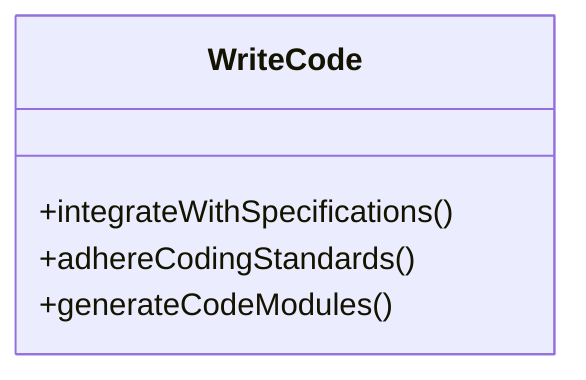

import { Callout, Steps, Step } from "nextra-theme-docs";

# Actions

In the **StratOptimus-TradingWizard** project, **Actions** are fundamental building blocks that encapsulate specific tasks and operations within the workflow automation framework. Each action is implemented as a Python class that inherits from `metagpt.actions.Action`. This modular approach facilitates high levels of reusability, maintainability, and scalability, allowing us to easily update or extend the system. Let's delve into the components that make up Actions and explore their significance.

## What Are Actions?

Actions are designed to perform individual tasks automatically, which contributes to the project’s overall strategy development and optimization processes. They ensure tasks are conducted efficiently and consistently across different stages of development.

<Callout>
Actions in the project help eliminate repetitive manual tasks, ensuring focus remains on strategic development.
</Callout>

## Key Action Scripts

Here's a breakdown of some critical action scripts, detailing their purpose and usage within the project.

### 1. WriteCode

The `WriteCode` action is responsible for the implementation of code based on predefined specifications and designs. It adheres to best coding practices, ensuring that the code is both robust and maintainable.



### 2. WriteCodeReview

This action conducts thorough code reviews. It provides constructive feedback and offers suggestions for improvements to ensure compliance with design specifications.

### 3. WriteTest

`WriteTest` develops and maintains automated test suites necessary to validate the reliability of the code. It ensures all components function as expected through continuous testing.

### 4. Research

The `Research` action performs in-depth research on trading strategies and market dynamics, generating insights that inform strategy development and refinement.

### 5. Project Management

Responsible for handling project management tasks such as task listing, and refining project dependencies. It facilitates organized and efficient project development workflows.

## Implementing Actions

Each action is implemented as a Python class and utilizes `ActionNode` instances to specify expected inputs and instructions. Here’s an example from `actions/project_management_an.py`:

```python
from typing import List, Optional
from metagpt.actions.action_node import ActionNode

REQUIRED_PACKAGES = ActionNode(
    key="Required packages",
    expected_type=Optional[List[str]],
    instruction="Provide required third-party packages in requirements.txt format.",
    example=["flask==1.1.2", "bcrypt==3.2.0"],
)
```

## How Actions Integrate with Workflows

Actions are not standalone; they integrate seamlessly with [Workflows](/key-functional-components/workflows) – orchestrating interactions between different actions and strategizing their sequence to achieve composite goals.

<Steps>
### Step 1: Define the Action

Create a Python class inheriting from `metagpt.actions.Action`.

### Step 2: Specify Inputs

Utilize `ActionNode` to define expected inputs and instructions for the action.

### Step 3: Integrate with Workflows

Connect the action with workflows to align its execution within the process sequence.

### Step 4: Execute

Execution is managed by the workflow, which calls the action as needed.
</Steps>

## Conclusion

In conclusion, Actions are the lifeblood of workflow automation within the **StratOptimus-TradingWizard** project. They perform essential tasks, tying together various components into an effective, harmonious system. For detailed insight into how Actions integrate with other functional components, explore the [Project Architecture](/project-architecture) section, where you’ll find discussions on elements like MetaGPT and their interactions within the system.