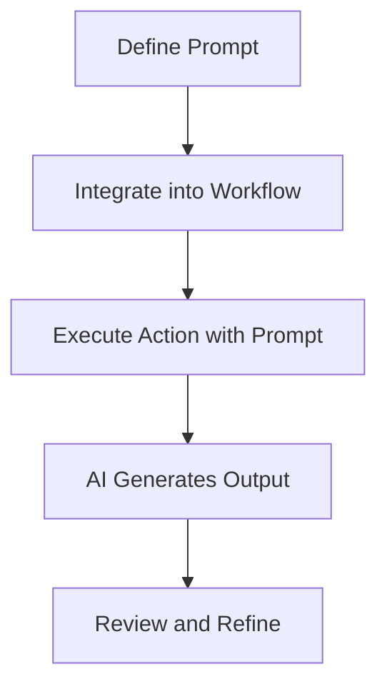

import { Callout, Steps, Step } from "nextra-theme-docs";

# Prompts

In the **StratOptimus-TradingWizard** project, **Prompts** play a pivotal role in guiding AI-driven tasks to ensure consistency and accuracy. They are akin to templates that provide a structured outline for the AI to follow, helping it generate reliable and contextually appropriate responses. This section delves into the key aspects of prompts, their usage, and how they integrate into the project's workflow.

## Understanding the Role of Prompts

Prompts are meticulously crafted to offer clarity and direction, enabling the AI to execute specific actions effectively. They are embedded within the [Actions](/key-functional-components/actions) and [Workflows](/key-functional-components/workflows) components, driving the AI to complete tasks such as optimizing strategies, generating reports, and conducting research.

### When to Use Prompts

**Prompts** are utilized in scenarios where predefined instructions enhance task performance. For example:

- **Strategy Optimization:** Utilizing templates for tweaking trading parameters based on performance data.
- **Report Generation:** Automating the creation of detailed financial reports with structured prompts.
- **Research and Analysis:** Guiding the AI through the analytical aspects of market data to derive insights.

## Crafting Effective Prompts

To create a prompt that drives precise outputs, it should include comprehensive yet concise instructions. The prompts should be tailored to the task's requirements, considering the computational models and expected outcomes.

**Example:** Here is a prompt template used for optimizing trading strategy parameters:
```python
PARAMETER_OPTIMIZATION_PROMPT = """
Optimize the following trading strategy parameters based on historical performance data. Provide the optimized values for each parameter to maximize the strategy's effectiveness.

Current Parameters:
{current_parameters}

In your response:
1. Suggest optimized values for each parameter.
2. Explain the rationale behind each suggested optimization.
3. Ensure that the proposed changes aim to improve key performance metrics such as total return, Sharpe ratio, and maximum drawdown.

Provide your response in a structured format with each parameter and its suggested optimized value.
"""
```

### Steps to Create a Custom Prompt

<Steps>

### Step 1: Identify the Task

Define the specific task for which the prompt is required, ensuring you have a clear understanding of the desired outcome and the data available.

### Step 2: Structure the Prompt

Outline the key components and instructions within the prompt, focusing on the context, required actions, and expected outputs. Use plain language to avoid ambiguity.

### Step 3: Test and Refine

Implement the prompt in a controlled environment, evaluate its performance, and refine it based on the AI's outputs. Iteratively improve the prompt to align with performance metrics.

</Steps>

## Integration with Workflows and Actions

Prompts are seamlessly integrated into the project's workflows, enabling coherent interaction between actions and automated tasks. For instance, during [Workflows](/key-functional-components/workflows) execution, prompts ensure that the AI follows a logical sequence of tasks, facilitating strategy development and testing.



## Benefits of Using Prompts

- **Consistency:** Prompts ensure uniformity in AI responses across different operations and tasks.
- **Efficiency:** By providing clear instructions, prompts reduce the need for extensive human intervention in routine tasks.
- **Quality:** Facilitates the generation of high-quality outputs by aligning AI performance with project standards.

For further reading on crafting prompts and their role in automation, see the relevant guidelines in our [Documentation and User Guides](/documentation-user-guides).