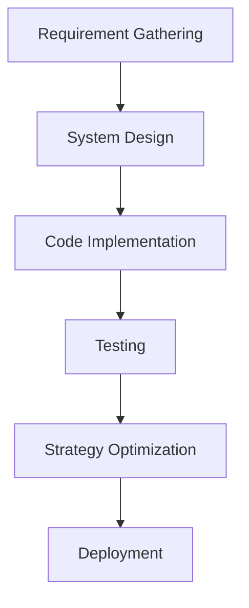
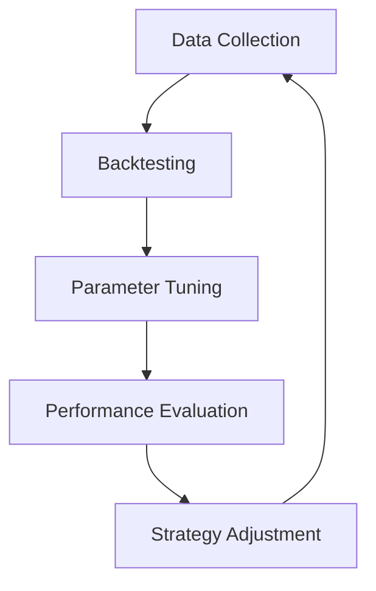
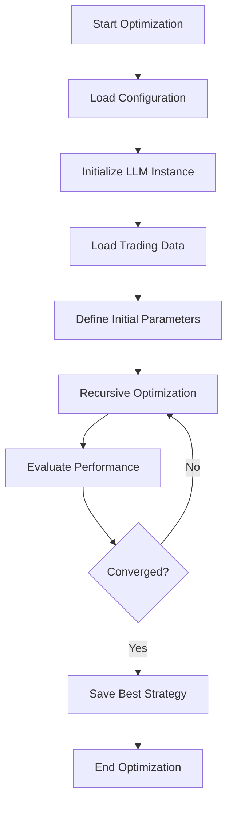

# Workflows

The **Workflows** section of the StratOptimus-TradingWizard project is crucial for defining the sequence of operations that guide the development lifecycle of trading strategies. Workflows orchestrate the interactions between various components, ensuring that tasks are performed in a structured and efficient manner. This section will explore the significance of workflows, how they are structured within the project, and offer a deep dive into some specific examples.

## Understanding Workflows

Workflows in the StratOptimus-TradingWizard project encapsulate the entire strategy development process, from requirement gathering to optimization. They automate complex processes, reducing manual intervention and maintaining consistency across tasks.

### Key Components of Workflows

- **Sequential Order:** Workflows define a chronological order of tasks, ensuring that each action is executed at the appropriate time.
- **Interdependent Tasks:** Tasks within a workflow are often interdependent, meaning the output of one task is the input for another.
- **Automation:** Automating processes streamlines development, reduces errors, and accelerates project completion.

<Callout>
Workflows are pivotal in achieving process automation, enhancing productivity, and ensuring high-quality outcomes.
</Callout>

## Workflow Structure

The workflows are organized to facilitate systematic progression and continuous improvement of trading strategies. Each workflow comprises a series of actions defined and executed by the MetaGPT framework.

### Example: Initial Strategy Development Workflow

Below is a mermaid diagram illustrating the initial strategy development workflow:

This workflow showcases the high-level steps involved in creating a new trading strategy, ensuring thorough planning, execution, and refinement before deployment.

### Example: Performance Testing and Optimization Workflow

The performance testing and optimization workflow is crucial for evaluating and enhancing strategy effectiveness. Below is an example of how this workflow might be structured:

Here, the loop from Strategy Adjustment back to Data Collection highlights the iterative nature of optimizing trading strategies.

### Example: Run Optimization Workflow

With the introduction of the `run_optimization.py` and enhancements in `graph.py`, the Run Optimization Workflow has become a core component of the trading strategy development process. This workflow leverages asynchronous execution and recursive optimization to fine-tune strategy parameters continuously.

#### Steps in Run Optimization Workflow

<Steps>
### Step 1: Start Optimization

Initiate the optimization process by executing the `run_optimization.py` script. This triggers the entire workflow.

### Step 2: Load Configuration

Load the trading configuration from the specified YAML file. This includes parameters for the LLM, initial strategy parameters, dataset information, and optimization settings.

### Step 3: Initialize LLM Instance

Create an instance of the Language Learning Model (LLM) using the loaded configuration. The LLM assists in parameter optimization through intelligent suggestions and evaluations.

### Step 4: Load Trading Data

Fetch trading data using the `load_trade_data` function. Ensure that the data is correctly formatted and accessible for backtesting.

### Step 5: Define Initial Parameters

Set the initial strategy parameters, which include thresholds, delays, window sizes, and other relevant metrics necessary for trading strategy optimization.

### Step 6: Recursive Optimization

Execute the `recursive_optimization` function, which iteratively adjusts strategy parameters to maximize performance metrics such as total return, Sharpe ratio, and maximum drawdown. This step leverages asynchronous execution to handle multiple evaluations in parallel, enhancing efficiency.

### Step 7: Evaluate Performance

Assess the optimized parameters by conducting backtests. Analyze the results to determine the effectiveness of the parameter adjustments.

### Step 8: Converged?

Check if the optimization has met the convergence threshold. If not, revert to recursive optimization for further fine-tuning. This loop continues until the strategy parameters converge to optimal values.

### Step 9: Save Best Strategy

Once convergence is achieved, save the best-performing strategy parameters to a JSON file for future reference and deployment.

### Step 10: End Optimization

Conclude the optimization process, ensuring all results are logged and saved appropriately.
</Steps>

## Managing Workflows with MetaGPT

The MetaGPT framework plays a vital role in managing workflows. It helps define custom actions and orchestrates them in predefined sequences to achieve desired outcomes.

### Benefits of Using MetaGPT

- **Customization:** Easily define and modify workflows according to project requirements.
- **Scalability:** Efficiently manage increasing complexity and scale of trading strategies.
- **Intelligence:** Leverage intelligent decision-making and automation for optimal results.

<Callout>
The integration of MetaGPT enhances workflow efficiency, enabling seamless management and execution of complex tasks.
</Callout>

### Example Workflow: Performance Testing and Optimization

The performance testing and optimization workflow is crucial for evaluating and enhancing strategy effectiveness. Below is an example of how this workflow might be structured:

Here, the loop from Strategy Adjustment back to Data Collection highlights the iterative nature of optimizing trading strategies.

### Example Workflow: Run Optimization

The Run Optimization Workflow integrates the newly developed `run_optimization.py` and enhanced `graph.py` to perform comprehensive trading strategy optimization. This workflow ensures that strategy parameters are continuously refined to achieve optimal performance.

## Creating Your Own Workflows

Creating a workflow involves defining the sequence of actions that lead to the completion of a project objective. Here's how you can create your own workflow:

<Steps>
### Step 1: Define Objectives

Clearly identify the goals you aim to achieve with the workflow. This can include tasks like developing a new strategy or optimizing an existing one.

### Step 2: Identify Actions

List out all the actions necessary to achieve your objectives. These could include data ingestion, model training, and performance monitoring.

### Step 3: Sequence Actions

Arrange the actions in a logical sequence that reflects dependencies and task order. Ensure each action receives the correct inputs and produces the necessary outputs for the next.

### Step 4: Implement in MetaGPT

Utilize the MetaGPT framework to implement the workflow, leveraging customized actions and prompts to automate tasks.

### Step 5: Test and Iterate

Execute the workflow, testing its effectiveness and making iterative improvements to optimize performance and outcomes.
</Steps>

For more details on specific actions and their implementation, refer to the [Actions](/key-functional-components/actions) section.

## Conclusion

Workflows are fundamental in structuring and automating the trading strategy development process in the StratOptimus-TradingWizard project. By leveraging the power of automation and intelligent orchestration through MetaGPT, workflows ensure that tasks are executed efficiently and effectively. Whether setting up a new strategy or optimizing existing processes, understanding and implementing workflows is critical to success.
