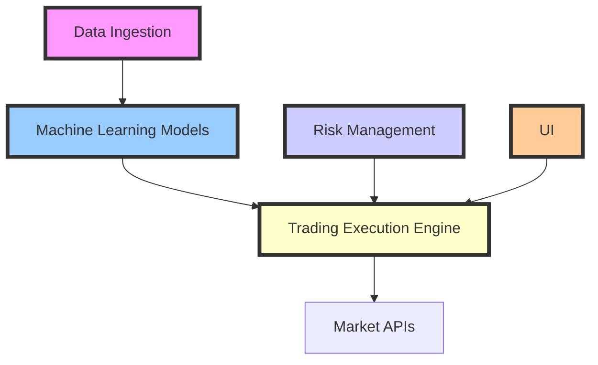

import { Callout, Steps, Step } from "nextra-theme-docs";

# Project Architecture

The architecture of the **StratOptimus-TradingWizard** project is meticulously designed to ensure **scalability**, **maintainability**, and **high performance**. This section provides a comprehensive overview of the core components of the project architecture and their interactions, emphasizing the project's ability to leverage cutting-edge technology to achieve sophisticated trading strategy development and execution.

## Core Components

The architecture encapsulates several interconnected layers and modules, each responsible for distinct aspects of strategy development and execution:

1. **MetaGPT Framework**: Serves as the backbone for workflow automation and intelligent decision-making through custom actions and action nodes. This framework is crucial for managing the complexity of workflows and ensuring that tasks are performed efficiently.
   
   - Visit [MetaGPT Framework Integration](/project-architecture/metagpt-framework-integration) for a deeper dive into how this framework operates within the project.

2. **JAX Integration**: Facilitates high-performance numerical computations, automatic differentiation, and optimized machine learning model training. JAX's capabilities are harnessed to rapidly process large datasets and perform sophisticated mathematical operations necessary for strategy refinement.

   - Explore more in [JAX and High-Performance Computing](/project-architecture/jax-high-performance-computing) to understand how JAX is utilized.

3. **Machine Learning Models**: Includes various ML models for predictive analytics, trend analysis, and optimization of trading parameters. These models form the core of the AI-driven approach to developing robust trading strategies.

   - Check [Machine Learning Models](/project-architecture/machine-learning-models) for a detailed explanation.

4. **Data Ingestion and Processing**: Handles the acquisition, cleaning, and transformation of financial data from multiple sources. This component ensures that data is ready for analysis and strategy development.

5. **Trading Execution Engine**: Manages the execution of trades based on generated strategies, ensuring timely and accurate market interactions. This engine interfaces with market APIs to execute trades with precision.

6. **Risk Management Modules**: Assess and mitigate potential financial risks, ensuring strategies adhere to predefined risk parameters. These modules are key to safeguarding trading operations against market volatility.

7. **User Interface (Optional)**: Provides a front-end interface for monitoring, control, and manual intervention in trading strategies, allowing users to engage directly with the trading process.

<Callout>
The project's architecture is a testament to its robustness and sophistication, providing a framework that supports advanced trading algorithms while maintaining ease of scalability and adaptability.
</Callout>

## System Design

The system design is carefully crafted to balance between complexity and usability, ensuring that the architecture can handle sophisticated computations while remaining user-friendly for developers and analysts.

### Key Design Principles

- **Modular Design**: Each component is developed as an independent module, promoting code reuse and ease of maintenance.
- **Scalable Infrastructure**: The architecture supports scaling up to accommodate larger datasets and more complex computations without performance degradation.
- **Secure Operations**: Security protocols are in place to protect sensitive trading information and ensure compliance with financial regulations.

## Interaction Between Components

The components of the project architecture are designed to interact seamlessly, allowing for efficient data flow and process management.

### Data-Driven Flow

- **Data Ingestion** feeds into **Machine Learning Models**, providing the necessary inputs for model training and prediction.
- Models output trading signals that are sent to the **Trading Execution Engine**, which executes trades with precision.
- **Risk Management Modules** continuously monitor trading activities for compliance and report back to improve strategy effectiveness.

<Steps>
### Step 1: Data Acquisition

Financial data is ingested from various sources, cleaned, and transformed for analysis.

### Step 2: Strategy Development

Machine learning models analyze the data to predict trends and generate trading strategies.

### Step 3: Execution

The Trading Execution Engine manages trade execution based on the strategies developed.

### Step 4: Monitoring and Adjustment

Risk Management Modules assess trading risks and provide feedback for strategy adjustment as needed.
</Steps>

The project's architecture is a powerful engine driving the development and implementation of advanced trading strategies. As we explore each component in detail, we uncover the intricate yet coherent design that enables StratOptimus-TradingWizard to navigate the complexities of financial markets with agility and precision.