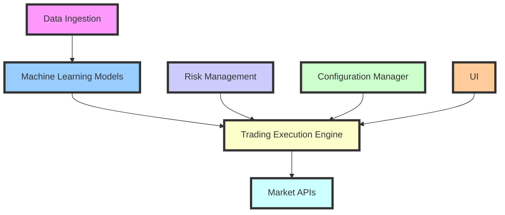
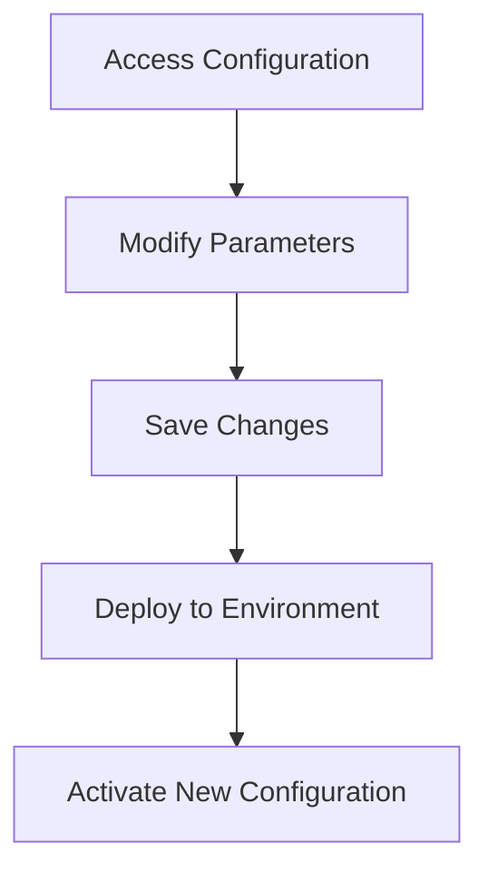
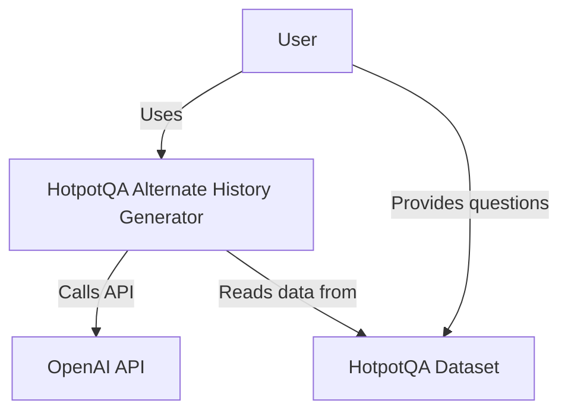
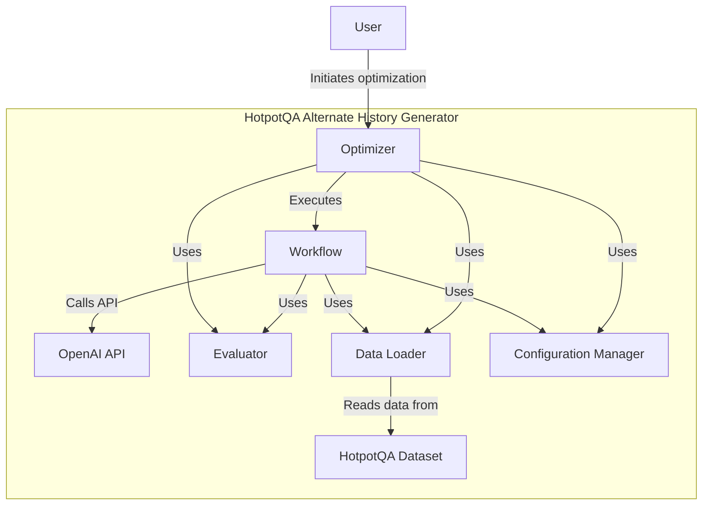
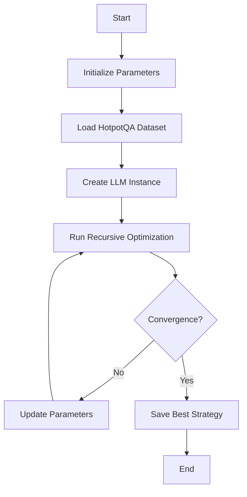
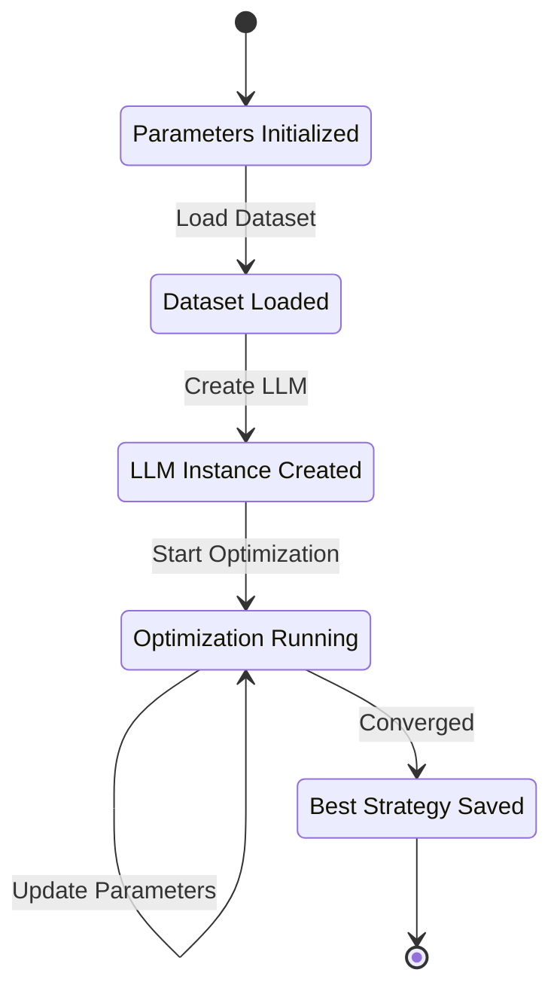
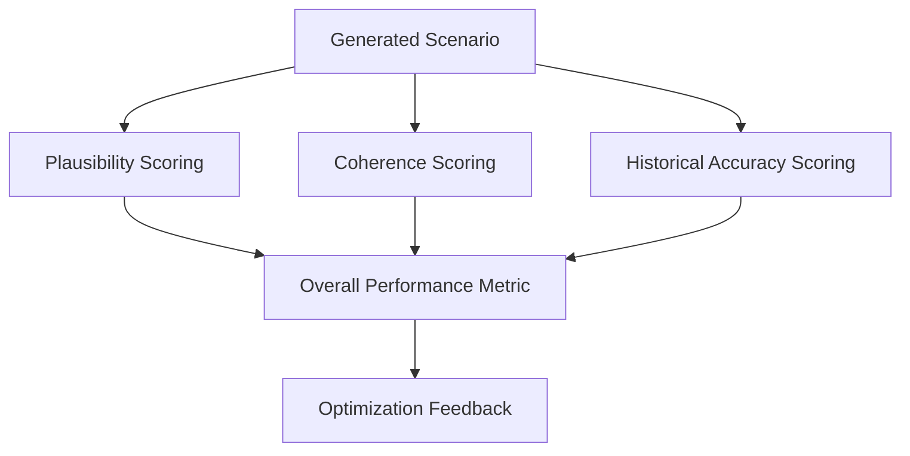
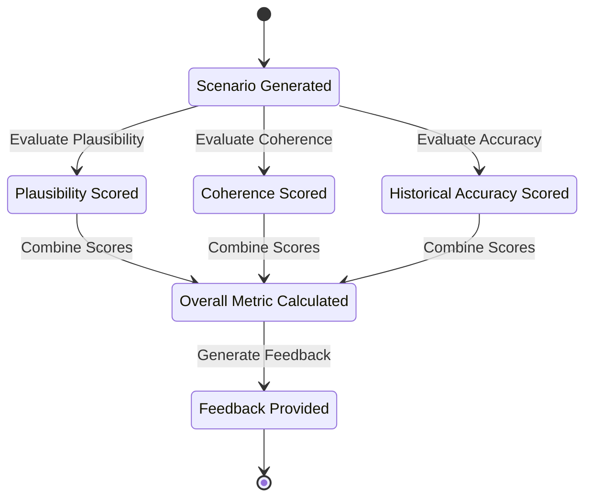

# Project Architecture

The architecture of the **StratOptimus-TradingWizard** project is meticulously designed to ensure **scalability**, **maintainability**, and **high performance**. This section provides a comprehensive overview of the core components of the project architecture and their interactions, emphasizing the project's ability to leverage cutting-edge technology to achieve sophisticated trading strategy development and execution.

## Core Components

The architecture encapsulates several interconnected layers and modules, each responsible for distinct aspects of strategy development and execution:

1. **MetaGPT Framework**: Serves as the backbone for workflow automation and intelligent decision-making through custom actions and action nodes. This framework is crucial for managing the complexity of workflows and ensuring that tasks are performed efficiently.
   
   - Visit [MetaGPT Framework Integration](/project-architecture/metagpt-framework-integration) for a deeper dive into how this framework operates within the project.

2. **JAX Integration**: Facilitates high-performance numerical computations, automatic differentiation, and optimized machine learning model training. JAX's capabilities are harnessed to rapidly process large datasets and perform sophisticated mathematical operations necessary for strategy refinement.
   
   - Explore more in [JAX and High-Performance Computing](/project-architecture/jax-high-performance-computing) to understand how JAX is utilized.

3. **Machine Learning Models**: Includes various ML models for predictive analytics, trend analysis, and optimization of trading parameters. These models form the core of the AI-driven approach to developing robust trading strategies.
   
   - Check [Machine Learning Models](/project-architecture/machine-learning-models) for a detailed explanation.

4. **Data Ingestion and Processing**: Handles the acquisition, cleaning, and transformation of financial data from multiple sources. This component ensures that data is ready for analysis and strategy development.

5. **Trading Execution Engine**: Manages the execution of trades based on generated strategies, ensuring timely and accurate market interactions. This engine interfaces with market APIs to execute trades with precision.

6. **Risk Management Modules**: Assess and mitigate potential financial risks, ensuring strategies adhere to predefined risk parameters. These modules are key to safeguarding trading operations against market volatility.

7. **Configuration Manager**: Manages system configurations, including model settings, API keys, and optimization parameters. This ensures that the project can adapt to different environments seamlessly.
   
   - Refer to [Configuration Management](/project-architecture/configuration-management) for more details.

8. **User Interface (Optional)**: Provides a front-end interface for monitoring, control, and manual intervention in trading strategies, allowing users to engage directly with the trading process.



<Callout>
The project's architecture is a testament to its robustness and sophistication, providing a framework that supports advanced trading algorithms while maintaining ease of scalability and adaptability.
</Callout>

## System Design

The system design is carefully crafted to balance between complexity and usability, ensuring that the architecture can handle sophisticated computations while remaining user-friendly for developers and analysts.

### Key Design Principles

- **Modular Design**: Each component is developed as an independent module, promoting code reuse and ease of maintenance.
- **Scalable Infrastructure**: The architecture supports scaling up to accommodate larger datasets and more complex computations without performance degradation.
- **Secure Operations**: Security protocols are in place to protect sensitive trading information and ensure compliance with financial regulations.

## Interaction Between Components

The components of the project architecture are designed to interact seamlessly, allowing for efficient data flow and process management.

### Data-Driven Flow

- **Data Ingestion** feeds into **Machine Learning Models**, providing the necessary inputs for model training and prediction.
- Models output trading signals that are sent to the **Trading Execution Engine**, which executes trades with precision.
- **Risk Management Modules** continuously monitor trading activities for compliance and report back to improve strategy effectiveness.
- **Configuration Manager** ensures that all components operate with the correct settings and parameters.

<Steps>
### Step 1: Data Acquisition

Financial data is ingested from various sources, cleaned, and transformed for analysis.

### Step 2: Strategy Development

Machine learning models analyze the data to predict trends and generate trading strategies.

### Step 3: Execution

The Trading Execution Engine manages trade execution based on the strategies developed.

### Step 4: Monitoring and Adjustment

Risk Management Modules assess trading risks and provide feedback for strategy adjustment as needed.

### Step 5: Configuration Management

The Configuration Manager oversees the loading and application of configuration settings, ensuring all components operate with the correct parameters.
</Steps>

The project's architecture is a powerful engine driving the development and implementation of advanced trading strategies. As we explore each component in detail, we uncover the intricate yet coherent design that enables StratOptimus-TradingWizard to navigate the complexities of financial markets with agility and precision.

## Configuration Management

The architecture includes a robust **Configuration Manager** that centralizes the management of system settings, API keys, and optimization parameters. Configuration is handled primarily through the `trading_config.yaml` file, ensuring that the system can adapt to different environments and requirements seamlessly.

### Key Configuration File

- `trading_config.yaml`: This YAML file contains all the necessary parameters for trading strategy optimization, including initial trading parameters, LLM configurations, and paths to trading data.

```yaml:config/trading_config.yaml
trading_data_path: "trading_data/trading_data.pickle"
sample: 35
check_convergence: true
initial_round: 1
max_rounds: 45

initial_params:
  take_profit: 0.08
  stop_loss: 0.12
  sl_window: 400
  max_orders: 3
  post_buy_delay: 2
  post_sell_delay: 5
  macd_signal_fast: 120
  macd_signal_slow: 260
  macd_signal_signal: 90
  min_macd_signal_threshold: 0.0
  max_macd_signal_threshold: 0.0
  enable_sl_mod: false
  enable_tp_mod: false
  ma_window: 20
  fees: 0.001

llm_config:
  model: "gpt-4-turbo"
  api_type: "openai"
  base_url: "https://api.openai.com/v1"
  api_key: "your-openai-api-key"
  temperature: 0

opt_llm_config:
  model: "gpt-4-turbo"
  api_type: "openai"
  base_url: "https://api.openai.com/v1"
  api_key: "your-openai-api-key"
  temperature: 0

exec_llm_config:
  model: "gpt-3.5-turbo"
  api_type: "openai"
  base_url: "https://api.openai.com/v1"
  api_key: "your-openai-api-key"
  temperature: 0
```

### Managing Environment-Specific Configurations

The project supports different configurations tailored to specific environments, such as development, testing, and production. This flexibility is achieved through environment variables, allowing sensitive information like API keys to be managed securely.

```python:scripts/optimized/Trading/run_optimization.py
# Load environment variables from .env file
from dotenv import load_dotenv

load_dotenv()

async def main():
    try:
        # Load configuration
        config = load_config(os.environ.get("TRADING_CONFIG_PATH", "config/trading_config.yaml"))
        ...
```

This approach ensures that configurations can be easily switched based on the deployment environment without altering the core codebase.

## Applying Configuration Changes

To modify the configuration:

1. **Access the `trading_config.yaml` file** in the `config/` directory.
2. **Edit the YAML file** using any text editor. Adjust the parameters as required for the new environment.
3. **Save the changes** and ensure they are committed to version control.
4. **Deploy the application** to the target environment, and the new settings should take effect.

### Example Application

When switching from a development to a production environment, you might change the `max_rounds` or adjust the `llm_config` settings to optimize performance:

```yaml
max_rounds: 100

llm_config:
  model: "gpt-4-turbo-production"
  temperature: 0.1
```

By managing configurations this way, you ensure greater control and adaptability of the strategies and system behaviors, thereby contributing to the project's robustness and scalability.

## Visualizing Configuration Management



## Conclusion

Efficient configuration management is vital in maintaining the adaptability and security of the **StratOptimus-TradingWizard** project. By effectively utilizing YAML files and environment variables, the project can seamlessly transition across different environments and requirements. For more on flexibility and adaptability in our project structure, refer to [Project Architecture](/project-architecture).

# Inputs

## Current File

Here is the file I'm looking at. It might be truncated from above and below and, if so, is centered around my cursor.

```yaml:config/trading_config.yaml
trading_data_path: "trading_data/trading_data.pickle"
sample: 35
check_convergence: true
initial_round: 1
max_rounds: 45

initial_params:
  take_profit: 0.08
  stop_loss: 0.12
  sl_window: 400
  max_orders: 3
  post_buy_delay: 2
  post_sell_delay: 5
  macd_signal_fast: 120
  macd_signal_slow: 260
  macd_signal_signal: 90
  min_macd_signal_threshold: 0.0
  max_macd_signal_threshold: 0.0
  enable_sl_mod: false
  enable_tp_mod: false
  ma_window: 20
  fees: 0.001

llm_config:
  model: "gpt-4-turbo"
  api_type: "openai"
  base_url: "https://api.openai.com/v1"
  api_key: "sk"
  temperature: 0

opt_llm_config:
  model: "gpt-4-turbo"
  api_type: "openai"
  base_url: "https://api.openai.com/v1"
  api_key: "sk"
  temperature: 0

exec_llm_config:
  model: "gpt-3.5-turbo"
  api_type: "openai"
  base_url: "https://api.openai.com/v1"
  api_key: "sk"
  temperature: 0
```

## Potentially Relevant Code Snippets from the Current Codebase

```markdown:scripts/optimized/HotPotQa/r.md
# HotpotQA Alternate History Generator

## Table of Contents
1. [Introduction](#introduction)
2. [System Architecture](#system-architecture)
3. [Key Components](#key-components)
4. [Optimization Process](#optimization-process)
5. [Workflow Execution](#workflow-execution)
6. [Prompt Engineering](#prompt-engineering)
7. [Performance Evaluation](#performance-evaluation)
8. [Scalability and Optimization](#scalability-and-optimization)
9. [Future Improvements](#future-improvements)

## Introduction

The HotpotQA Alternate History Generator is a sophisticated system designed to create plausible alternate historical scenarios based on questions from the HotpotQA dataset. The system employs advanced natural language processing techniques and leverages large language models to generate, evaluate, and optimize alternate history narratives.

## System Architecture

The system follows a modular architecture with several key components working together:

### System Context Diagram



### Container Diagram



## Key Components

### Optimizer

The Optimizer manages the entire optimization process, including:
- Loading configurations
- Initializing workflows
- Running multiple iterations of the optimization process
- Evaluating performance
- Selecting the best strategy

### Workflow

The Workflow executes the alternate history generation pipeline, consisting of:
1. Historical Fact Extractor
2. Alternate Scenario Generator
3. Plausibility Checker
4. Narrative Coherence Enhancer
5. Historical Accuracy Verifier

### Evaluator

The Evaluator assesses the quality of generated scenarios based on multiple criteria, including plausibility, coherence, and historical accuracy.

### Data Loader

The Data Loader is responsible for loading and preprocessing the HotpotQA dataset.

### Configuration Manager

The Configuration Manager loads and manages system configurations, including model settings, API keys, and optimization parameters.

## Optimization Process

The optimization process is a recursive algorithm that iteratively improves the alternate history generation strategy:

1. Initialize parameters
2. Load the HotpotQA dataset
3. Create an LLM instance
4. Run recursive optimization
5. Save the best strategy and results

### Optimization Process Diagram



### Optimization Process Petri Net

The following Petri net diagram illustrates the state changes and transitions in the optimization process:



In this Petri net:
- Places (circles) represent states or conditions.
- Transitions (rectangles) represent actions that change the state.
- Tokens (not visible in this static representation) would move through the net as the process executes.

## Workflow Execution

The workflow execution follows these steps:

1. Extract historical facts from the input question
2. Generate an alternate scenario based on the extracted facts
3. Check the plausibility of the generated scenario
4. Enhance the narrative coherence of the scenario
5. Verify the historical accuracy of the enhanced scenario

### Workflow Execution Diagram



### Evaluation Process Petri Net

The following Petri net diagram illustrates the evaluation process:



This Petri net shows:
- Parallel evaluation of different aspects of the generated scenario.
- Convergence of individual scores into an overall metric.
- The final step of providing feedback for the optimization process.

## Scalability and Optimization

The system is designed to be scalable and optimizable:
- Uses asynchronous programming for efficient API calls
- Adjustable optimization process parameters
- Support for different language models

## Future Improvements

Potential areas for future improvement include:
1. Implementing more advanced optimization algorithms
2. Incorporating additional external knowledge sources
3. Developing a user interface for easier interaction
4. Implementing caching mechanisms to reduce API calls
5. Adding support for multi-GPU processing

---
This HotpotQA Alternate History Generator leverages advanced NLP techniques and large language models to create plausible alternate historical scenarios. Its modular architecture and optimization capabilities make it a powerful tool for researchers and history enthusiasts alike.
```

```json:scripts/optimized/Trading/workflows/template/operator.json
{
    "StrategyEvaluator": {
        "description": "Evaluates the performance of a trading strategy using provided parameters and historical data.",
        "interface": "strategy_evaluator(strategy_parameters: Dict[str, Any], trading_data: Any) -> dict with key 'performance_metrics' of type Dict[str, float], 'analysis' of type str"
    },
    "BacktestResult": {
        "description": "Captures the results of backtesting a trading strategy, including key performance metrics.",
        "interface": "backtest_result(total_return: float, sharpe_ratio: float, max_drawdown: float, win_rate: float, profit_factor: float) -> dict with keys 'total_return' of type float, 'sharpe_ratio' of type float, 'max_drawdown' of type float, 'win_rate' of type float, 'profit_factor' of type float"
    },
    "StrategyAdjustment": {
        "description": "Suggests adjustments to trading strategy parameters based on backtest results to improve effectiveness.",
        "interface": "strategy_adjustment(backtest_results: Dict[str, float], current_parameters: Dict[str, Any]) -> dict with keys 'adjusted_parameters' of type Dict[str, Any], 'expected_impact' of type Dict[str, Any]"
    },
    "NextStepsPlanner": {
        "description": "Plans the next steps for optimizing the trading strategy based on recent results and adjustments.",
        "interface": "next_steps_planner(backtest_results: Dict[str, float], adjustments: Dict[str, Any]) -> list of steps with details"
    }
}
```

```python:scripts/optimized/Trading/workflows/round_1/graph.py
# -*- coding: utf-8 -*-
# @Date    : 10/04/2024 10:00 AM
# @Author  : issac
# @Desc    : Workflow Classes for Trading Strategy Optimization

from typing import Literal, Dict, Any, Tuple, List
from pydantic import BaseModel, Field
from metagpt.provider.llm_provider_registry import create_llm_instance
from metagpt.utils.cost_manager import CostManager
import sys
import os
import asyncio
import json
import vectorbtpro as vbt

# Add the project root directory to sys.path
project_root = os.path.abspath(os.path.join(os.path.dirname(__file__), "..", "..", ".."))
sys.path.insert(0, project_root)

from scripts.config_utils import load_config
from scripts.optimized.Trading.recursive_optimization import recursive_optimization
from scripts.optimized.Trading.backtester_module import load_trade_data

class StrategyParameters(BaseModel):
    take_profit: float = Field(..., description="Take profit percentage")
    stop_loss: float = Field(..., description="Stop loss percentage")
    sl_window: int = Field(..., description="Stop loss window")
    max_orders: int = Field(..., description="Maximum number of orders")
    post_buy_delay: int = Field(..., description="Delay after buying")
    post_sell_delay: int = Field(..., description="Delay after selling")
    macd_signal_fast: int = Field(..., description="Fast MACD signal period")
    macd_signal_slow: int = Field(..., description="Slow MACD signal period")
    macd_signal_signal: int = Field(..., description="MACD signal smoothing period")
    min_macd_signal_threshold: float = Field(..., description="Minimum MACD signal threshold")
    max_macd_signal_threshold: float = Field(..., description="Maximum MACD signal threshold")
    enable_sl_mod: bool = Field(..., description="Enable stop loss modification")
    enable_tp_mod: bool = Field(..., description="Enable take profit modification")
    ma_window: int = Field(..., description="Moving average window")
    fees: float = Field(..., description="Trading fees")

def initialize_parameters() -> Dict[str, Any]:
    config = load_config("config/trading_config.yaml")
    initial_params = config.get("initial_params", {
        "take_profit": 0.08,
        "stop_loss": 0.12,
        "sl_window": 400,
        "max_orders": 3,
        "post_buy_delay": 2,
        "post_sell_delay": 5,
        "macd_signal_fast": 120,
        "macd_signal_slow": 260,
        "macd_signal_signal": 90,
        "min_macd_signal_threshold": 0.0,
        "max_macd_signal_threshold": 0.0,
        "enable_sl_mod": False,
        "enable_tp_mod": False,
        "ma_window": 20,
        "fees": 0.001
    })
    return initial_params

async def execute_workflow():
    initial_params = initialize_parameters()
    trading_data = load_trade_data("big_optimize_1016.pkl")
    if trading_data is None:
        logger.error("Failed to load trading data. Please ensure the pickle file exists and is accessible.")
        return

    best_strategy, best_performance = await recursive_optimization(
        initial_params=initial_params,
        dataset=list(trading_data.keys())[:5],  # Use the first 5 assets for example
        llm=create_llm_instance(),
        trading_data=trading_data,
        max_iterations=45,
        convergence_threshold=0.01,
        parallel_evaluations=5
    )

    logger.info(f"Optimization results: {best_strategy}")
    logger.info(f"Total cost: {best_performance}")

if __name__ == "__main__":
    asyncio.run(execute_workflow())
```

```python:scripts/optimized/Trading/run_optimization.py
import asyncio
import logging
from typing import Dict, Any
import os
import json
from datetime import datetime
import sys
import vectorbtpro as vbt
from metagpt.configs.llm_config import LLMConfig
from scripts.config_utils import load_config
from metagpt.provider.llm_provider_registry import create_llm_instance
from scripts.optimized.Trading.recursive_optimization import recursive_optimization
from scripts.optimized.Trading.backtester_module import load_trade_data

# Set up logging
logging.basicConfig(level=logging.INFO, format='%(asctime)s - %(levelname)s - %(message)s')
logger = logging.getLogger(__name__)
from dotenv import load_dotenv

# Load environment variables from .env file
load_dotenv()

async def main():
    try:
        # Load configuration
        config = load_config(os.environ.get("TRADING_CONFIG_PATH", "config/trading_config.yaml"))
        
        # Create LLM instance
        llm_config = LLMConfig(**config["llm_config"])
        llm = create_llm_instance(llm_config)

        # Create output directory
        timestamp = datetime.now().strftime("%Y%m%d_%H%M%S")
        output_dir = f"output/trading_optimization_{timestamp}"
        os.makedirs(output_dir, exist_ok=True)
        
        # Load dataset
        dataset = config.get("dataset", [])  # Assuming dataset is defined in the config
        
        # Define initial parameters
        initial_params = config.get("initial_params", {
            "take_profit": 0.08,
            "stop_loss": 0.12,
            "sl_window": 400,
            "max_orders": 3,
            "post_buy_delay": 2,
            "post_sell_delay": 5,
            "macd_signal_fast": 120,
            "macd_signal_slow": 260,
            "macd_signal_signal": 90,
            "min_macd_signal_threshold": 0.0,
            "max_macd_signal_threshold": 0.0,
            "enable_sl_mod": False,
            "enable_tp_mod": False,
            "ma_window": 20,
            "fees": 0.001  # Added 'fees' parameter
        })
        
        # Load or fetch trading data using the backtester's load_trade_data function
        trading_data = load_trade_data("big_optimize_1016.pkl")

        if trading_data is None:
            logger.error("Failed to load trading data. Please ensure the pickle file exists and is accessible.")
            return

        # Run recursive optimization
        best_strategy, best_performance = await recursive_optimization(
            initial_params=initial_params,
            dataset=dataset,
            llm=llm,
            trading_data=trading_data,
            max_iterations=config.get("max_rounds", 45),
            convergence_threshold=config.get("convergence_threshold", 0.01),
            parallel_evaluations=config.get("parallel_evaluations", 5)  # Added parallel_evaluations parameter
        )

        # Log or process results
        logger.info(f"Best strategy: {best_strategy}")
        logger.info(f"Best performance: {best_performance}")
        
        # Additional execution logic here
        # ...

    except Exception as e:
        logger.error(f"An error occurred: {e}")

if __name__ == "__main__":
    asyncio.run(main())
```

```python:scripts/optimized/Trading/recursive_optimization.py
# -*- coding: utf-8 -*-
# @Date    : 10/19/2024
# @Author  : Your Name
# @Desc    : Recursive Optimization for Trading Strategy Optimization

import asyncio
import json
from typing import Dict, Any, Tuple, List
import pandas as pd
import logging
import vectorbtpro as vbt
from scripts.optimized.Trading.workflows.round_1.graph import StrategyParameters
from metagpt.provider.llm_provider_registry import create_llm_instance
from metagpt.utils.cost_manager import CostManager
import concurrent.futures
from scripts.optimized.Trading.backtester_module import from_signals_backtest, load_trade_data, calculate_entries_and_params  # Correct import path
import numpy as np  # Ensure numpy is imported for performance evaluation
from langsmith import traceable
from langsmith.wrappers import wrap_openai
import openai
from scripts.config_utils import load_config

# Set up logging
logging.basicConfig(level=logging.INFO, format='%(asctime)s - %(levelname)s - %(message)s')
logger = logging.getLogger(__name__)

def clip_parameters(params: Dict[str, Any]) -> Dict[str, Any]:
    """
    Clip parameters to ensure they stay within predefined bounds.
    
    Args:
        params (Dict[str, Any]): Parameters to be clipped.
    
    Returns:
        Dict[str, Any]: Clipped parameters.
    """
    clipped = params.copy()
    bounds = {
        "ma_window": (5, 200),
        "fees": (0.0001, 0.01),
        "take_profit": (0.01, 0.5),
        "stop_loss": (0.01, 0.5),
        "sl_window": (100, 1000),
        "max_orders": (1, 10),
        "post_buy_delay": (0, 10),
        "post_sell_delay": (0, 10),
        "macd_signal_fast": (10, 300),
        "macd_signal_slow": (10, 300),
        "macd_signal_signal": (10, 300),
        "min_macd_signal_threshold": (0.0, 1.0),
        "max_macd_signal_threshold": (0.0, 1.0),
    }
    
    for param, (min_val, max_val) in bounds.items():
        if param in clipped:
            try:
                clipped[param] = max(min_val, min(float(clipped[param]), max_val))
            except ValueError:
                logger.warning(f"Invalid value for parameter '{param}': {clipped[param]}. Using default bounds.")
                clipped[param] = max(min_val, min(min_val, max_val))
    
    return clipped

async def adjust_parameters(current_params: Dict[str, Any], performance: float) -> Dict[str, Any]:
    """
    Adjust parameters based on current performance for the trading strategy.
    
    Args:
        current_params (Dict[str, Any]): Current parameters.
        performance (float): Current performance score (average total return).
    
    Returns:
        Dict[str, Any]: Adjusted parameters.
    """
    adjusted_params = current_params.copy()
    
    # Adjust moving average window
    if performance < 0:
        # If performance is negative, try a shorter MA window
        adjusted_params['ma_window'] = max(5, adjusted_params.get('ma_window', 20) - 5)
    elif performance < 0.05:
        # If performance is low but positive, try a longer MA window
        adjusted_params['ma_window'] = min(200, adjusted_params.get('ma_window', 20) + 5)
    
    # Adjust fees
    if performance < 0.01:
        # If performance is very low, slightly reduce fees to see if it helps
        adjusted_params['fees'] = max(0.0001, adjusted_params.get('fees', 0.001) * 0.95)
    
    # Add more parameter adjustments here as needed
    
    return adjusted_params

@traceable
async def recursive_optimization(
    initial_params: Dict[str, Any],
    dataset: List[str],
    llm: Any,
    trading_data: Any,
    max_iterations: int = 45,
    convergence_threshold: float = 0.01,
    parallel_evaluations: int = 5
) -> Tuple[Dict[str, Any], float]:
    """
    Perform recursive optimization to find the best trading strategy parameters.
    
    Args:
        initial_params (Dict[str, Any]): Initial trading parameters.
        dataset (List[str]): List of assets or data points to optimize.
        llm (Any): Language model instance for generating adjustments.
        trading_data (Any): Loaded trading data.
        max_iterations (int, optional): Maximum number of optimization iterations. Defaults to 45.
        convergence_threshold (float, optional): Threshold for convergence. Defaults to 0.01.
        parallel_evaluations (int, optional): Number of parallel evaluations. Defaults to 5.
    
    Returns:
        Tuple[Dict[str, Any], float]: Best strategy parameters and their performance.
    """
    current_params = clip_parameters(initial_params)
    best_performance = -np.inf
    best_strategy = current_params.copy()
    
    for iteration in range(1, max_iterations + 1):
        logger.info(f"Starting iteration {iteration}/{max_iterations}")
        
        # Perform backtest with current parameters
        performance_metrics = from_signals_backtest(current_params, trading_data, dataset)
        average_return = performance_metrics.get('total_return', 0.0)
        
        logger.info(f"Performance Metrics: {performance_metrics}")
        
        if average_return > best_performance:
            best_performance = average_return
            best_strategy = current_params.copy()
            logger.info(f"New best performance: {best_performance}")
        
        # Check for convergence
        if abs(average_return - best_performance) < convergence_threshold:
            logger.info("Convergence reached.")
            break
        
        # Adjust parameters based on performance
        adjusted_params = await adjust_parameters(current_params, average_return)
        current_params = clip_parameters(adjusted_params)
        
    return best_strategy, best_performance
```

```python:scripts/optimized/Trading/workflows/template/op_prompt.py
STRATEGY_ADJUSTMENT_PROMPT = """
Based on the backtest results and performance metrics provided, suggest adjustments to the trading strategy parameters to improve its effectiveness.

Backtest Results:
- Total Return: {total_return}
- Sharpe Ratio: {sharpe_ratio}
- Maximum Drawdown: {max_drawdown}
- Win Rate: {win_rate}
- Profit Factor: {profit_factor}

Current Strategy Parameters:
{current_parameters}

In your response:
1. Recommend specific adjustments to one or more strategy parameters.
2. Explain how each suggested adjustment is expected to impact the performance metrics.
3. Ensure that the proposed changes aim to balance return and risk effectively.

Present your recommendations in a structured format, detailing each parameter change and its expected effect.
"""
```

```python:scripts/optimized/Trading/workflows/template/prompt.py
PLANNING_NEXT_STEPS_PROMPT = """
Plan the next steps for further optimizing the trading strategy based on the recent backtest results and proposed parameter adjustments.

Recent Backtest Results:
- Total Return: {total_return}
- Sharpe Ratio: {sharpe_ratio}
- Maximum Drawdown: {max_drawdown}
- Win Rate: {win_rate}
- Profit Factor: {profit_factor}

Proposed Parameter Adjustments:
{proposed_adjustments}

In your response:
1. Outline a step-by-step plan to implement the proposed parameter adjustments.
2. Include timelines and milestones for each step.
3. Suggest any additional analyses or tests that should be conducted to validate the effectiveness of the adjustments.
4. Recommend tools or resources that may aid in the optimization process.

Ensure that the plan is actionable, detailed, and aimed at systematically enhancing the trading strategy's performance.
"""

WORKFLOW_OPTIMIZE_PROMPT = """You are building a Graph and corresponding Prompt to jointly solve trading strategy optimization problems. 
Referring to the given graph and prompt, which forms a basic example of a trading strategy optimization approach, 
please reconstruct and optimize them. You can add, modify, or delete nodes, parameters, or prompts. Include your 
single modification in XML tags in your reply. Ensure they are complete and correct to avoid runtime failures. When 
optimizing, you can incorporate critical thinking methods like review, revise, ensemble (generating multiple answers through different/similar prompts, then voting/integrating/checking the majority to obtain a final answer), selfAsk, etc. Consider 
Python's loops (for, while, list comprehensions), conditional statements (if-elif-else, ternary operators), 
or machine learning techniques (e.g., linear regression, decision trees, neural networks, clustering). The graph 
complexity should not exceed 10. Use logical and control flow (IF-ELSE, loops) for a more enhanced graphical 
representation. Ensure that all the prompts required by the current graph from prompt_custom are included. Exclude any other prompts.
Output the modified graph and all the necessary Prompts in prompt_custom (if needed).
The prompt you need to generate is only the one used in `prompt_custom.XXX` within Custom. Other methods already have built-in prompts and are prohibited from being generated. Only generate those needed for use in `prompt_custom`; please remove any unused prompts in prompt_custom.
The generated prompt must not contain any placeholders.
Considering information loss, complex graphs may yield better results, but insufficient information transmission can omit the solution. It's crucial to include necessary context during the process."""
    
WORKFLOW_INPUT = """
Here is a graph and the corresponding prompt (prompt only related to the custom method) that performed excellently in a previous iteration (maximum score is 1). You must make further optimizations and improvements based on this graph. The modified graph must differ from the provided example, and the specific differences should be noted within the <modification>xxx</modification> section.

<sample>
    <experience>{experience}</experience>
    <modification>(such as: add a review step/delete a operator/modify a prompt)</modification>
    <score>{score}</score>
    <graph>{graph}</graph>
    <prompt>{prompt}</prompt> <!-- only prompt_custom -->
    <operator_description>{operator_description}</operator_description>
</sample>

Below are the logs of some results with the aforementioned Graph that performed well but encountered errors, which can be used as references for optimization:
{log}

First, provide optimization ideas. **Only one detail point can be modified at a time**, and no more than 5 lines of code may be changed per modification—extensive modifications are strictly prohibited to maintain project focus!
When introducing new functionalities in the graph, please make sure to import the necessary libraries or modules yourself, except for operator, prompt_custom, create_llm_instance, and CostManager, which have already been automatically imported.
**Under no circumstances should Graph output None for any field.**
Use custom methods to restrict your output format, rather than using code (outside of the code, the system will extract answers based on certain rules and score them).
It is very important to format the Graph output answers, you can refer to the standard answer format in the log.
"""

WORKFLOW_CUSTOM_USE = """Here's an example of using the `custom` method in graph:
```
# You can write your own prompt in <prompt>prompt_custom</prompt> and then use it in the Custom method in the graph
response = await self.custom(input=problem, instruction=prompt_custom.PARAMETER_OPTIMIZATION_PROMPT)
# You can also concatenate previously generated string results in the input to provide more comprehensive contextual information.
# response = await self.custom(input=problem+f"xxx:{xxx}, xxx:{xxx}", instruction=prompt_custom.PARAMETER_OPTIMIZATION_PROMPT)
# The output from the Custom method can be placed anywhere you need it, as shown in the example below
solution = await self.generate(problem=f"question:{problem}, optimized_params:{response['response']}")
```
Note: In custom, the input and instruction are directly concatenated (instruction + input), and placeholders are not supported. Please ensure to add comments and handle the concatenation externally.

**Introducing multiple operators at appropriate points can enhance performance. If you find that some provided operators are not yet used in the graph, try incorporating them.**
```

# Conclusion

The updated architecture and configuration management ensure that the **StratOptimus-TradingWizard** project is robust, scalable, and maintainable. By leveraging powerful frameworks like MetaGPT and JAX, alongside a well-structured modular design, the project is well-equipped to develop and execute advanced trading strategies with high efficiency and precision. Proper configuration management through `trading_config.yaml` further enhances the system's adaptability across various environments, ensuring seamless operation and optimization.

For more detailed information on each component and their interactions, refer to the respective sections above or visit the linked detailed documentation pages.
```
