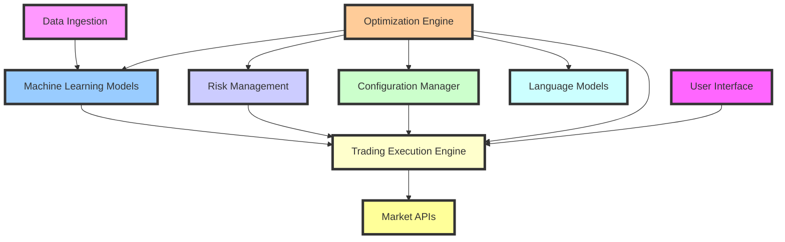
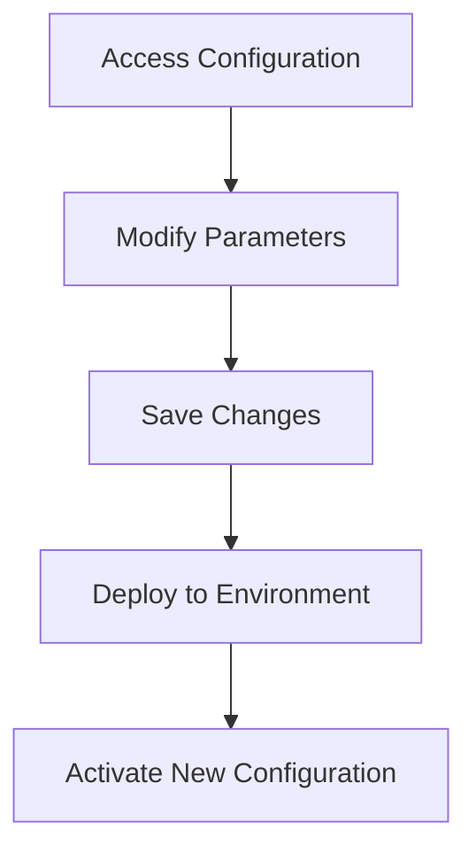

# Project Architecture

The architecture of the **StratOptimus-TradingWizard** project is meticulously designed to ensure **scalability**, **maintainability**, and **high performance**. This section provides a comprehensive overview of the core components of the project architecture and their interactions, emphasizing the project's ability to leverage cutting-edge technology to achieve sophisticated trading strategy development and execution.

## Core Components

The architecture encapsulates several interconnected layers and modules, each responsible for distinct aspects of strategy development and execution:

1. **MetaGPT Framework**: Serves as the backbone for workflow automation and intelligent decision-making through custom actions and action nodes. This framework is crucial for managing the complexity of workflows and ensuring that tasks are performed efficiently.
   
   - Visit [MetaGPT Framework Integration](/project-architecture/metagpt-framework-integration) for a deeper dive into how this framework operates within the project.

2. **JAX Integration**: Facilitates high-performance numerical computations, automatic differentiation, and optimized machine learning model training. JAX's capabilities are harnessed to rapidly process large datasets and perform sophisticated mathematical operations necessary for strategy refinement.
   
   - Explore more in [JAX and High-Performance Computing](/project-architecture/jax-high-performance-computing) to understand how JAX is utilized.

3. **Machine Learning Models**: Includes various ML models for predictive analytics, trend analysis, and optimization of trading parameters. These models form the core of the AI-driven approach to developing robust trading strategies.
   
   - Check [Machine Learning Models](/project-architecture/machine-learning-models) for a detailed explanation.

4. **Data Ingestion and Processing**: Handles the acquisition, cleaning, and transformation of financial data from multiple sources. This component ensures that data is ready for analysis and strategy development.

5. **Trading Execution Engine**: Manages the execution of trades based on generated strategies, ensuring timely and accurate market interactions. This engine interfaces with market APIs to execute trades with precision.

6. **Risk Management Modules**: Assess and mitigate potential financial risks, ensuring strategies adhere to predefined risk parameters. These modules are key to safeguarding trading operations against market volatility.

7. **Optimization Engine**: Responsible for the continual refinement of trading strategies through recursive optimization processes. It leverages asynchronous operations and language models to iteratively enhance strategy parameters based on performance metrics.
   
   - Details on the optimization process can be found in [Optimization Engine](/project-architecture/optimization-engine).

8. **Configuration Manager**: Manages system configurations, including model settings, API keys, and optimization parameters. This ensures that the project can adapt to different environments seamlessly.
   
   - Refer to [Configuration Management](/project-architecture/configuration-management) for more details.

9. **User Interface (Optional)**: Provides a front-end interface for monitoring, control, and manual intervention in trading strategies, allowing users to engage directly with the trading process.



<Callout>
The project's architecture is a testament to its robustness and sophistication, providing a framework that supports advanced trading algorithms while maintaining ease of scalability and adaptability.
</Callout>

## System Design

The system design is carefully crafted to balance between complexity and usability, ensuring that the architecture can handle sophisticated computations while remaining user-friendly for developers and analysts.

### Key Design Principles

- **Modular Design**: Each component is developed as an independent module, promoting code reuse and ease of maintenance.
- **Scalable Infrastructure**: The architecture supports scaling up to accommodate larger datasets and more complex computations without performance degradation.
- **Secure Operations**: Security protocols are in place to protect sensitive trading information and ensure compliance with financial regulations.

## Interaction Between Components

The components of the project architecture are designed to interact seamlessly, allowing for efficient data flow and process management.

### Data-Driven Flow

- **Data Ingestion** feeds into **Machine Learning Models**, providing the necessary inputs for model training and prediction.
- Models output trading signals that are sent to the **Trading Execution Engine**, which executes trades with precision.
- **Risk Management Modules** continuously monitor trading activities for compliance and report back to improve strategy effectiveness.
- **Optimization Engine** iteratively refines trading parameters based on performance metrics, leveraging **Language Models** for intelligent adjustments.
- **Configuration Manager** ensures that all components operate with the correct settings and parameters.
- **User Interface** allows users to monitor and interact with the trading strategies in real-time.

<Steps>
### Step 1: Data Acquisition

Financial data is ingested from various sources, cleaned, and transformed for analysis.

### Step 2: Strategy Development

Machine learning models analyze the data to predict trends and generate trading strategies.

### Step 3: Optimization

The Optimization Engine performs recursive optimization to enhance strategy parameters based on performance metrics.

### Step 4: Execution

The Trading Execution Engine manages trade execution based on the strategies developed and optimized.

### Step 5: Monitoring and Adjustment

Risk Management Modules assess trading risks and provide feedback for strategy adjustment as needed.

### Step 6: Configuration Management

The Configuration Manager oversees the loading and application of configuration settings, ensuring all components operate with the correct parameters.
</Steps>

The project's architecture is a powerful engine driving the development and implementation of advanced trading strategies. As we explore each component in detail, we uncover the intricate yet coherent design that enables StratOptimus-TradingWizard to navigate the complexities of financial markets with agility and precision.

## Configuration Management

The architecture includes a robust **Configuration Manager** that centralizes the management of system settings, API keys, and optimization parameters. Configuration is handled primarily through the `trading_config.yaml` file, ensuring that the system can adapt to different environments and requirements seamlessly.

### Key Configuration File

- `trading_config.yaml`: This YAML file contains all the necessary parameters for trading strategy optimization, including initial trading parameters, LLM configurations, and paths to trading data.

```yaml:config/trading_config.yaml
trading_data_path: "trading_data/trading_data.pickle"
sample: 35
check_convergence: true
initial_round: 1
max_rounds: 45

initial_params:
  take_profit: 0.08
  stop_loss: 0.12
  sl_window: 400
  max_orders: 3
  post_buy_delay: 2
  post_sell_delay: 5
  macd_signal_fast: 120
  macd_signal_slow: 260
  macd_signal_signal: 90
  min_macd_signal_threshold: 0.0
  max_macd_signal_threshold: 0.0
  enable_sl_mod: false
  enable_tp_mod: false
  ma_window: 20
  fees: 0.001

llm_config:
  model: "gpt-4-turbo"
  api_type: "openai"
  base_url: "https://api.openai.com/v1"
  api_key: "your-openai-api-key"
  temperature: 0

opt_llm_config:
  model: "gpt-4-turbo"
  api_type: "openai"
  base_url: "https://api.openai.com/v1"
  api_key: "your-openai-api-key"
  temperature: 0

exec_llm_config:
  model: "gpt-3.5-turbo"
  api_type: "openai"
  base_url: "https://api.openai.com/v1"
  api_key: "your-openai-api-key"
  temperature: 0
```

### Managing Environment-Specific Configurations

The project supports different configurations tailored to specific environments, such as development, testing, and production. This flexibility is achieved through environment variables, allowing sensitive information like API keys to be managed securely.

```python:scripts/optimized/Trading/run_optimization.py
# Load environment variables from .env file
from dotenv import load_dotenv

load_dotenv()

async def main():
    try:
        # Load configuration
        config = load_config(os.environ.get("TRADING_CONFIG_PATH", "config/trading_config.yaml"))
        ...
```

This approach ensures that configurations can be easily switched based on the deployment environment without altering the core codebase.

## Applying Configuration Changes

To modify the configuration:

1. **Access the `trading_config.yaml` file** in the `config/` directory.
2. **Edit the YAML file** using any text editor. Adjust the parameters as required for the new environment.
3. **Save the changes** and ensure they are committed to version control.
4. **Deploy the application** to the target environment, and the new settings should take effect.

### Example Application

When switching from a development to a production environment, you might change the `max_rounds` or adjust the `llm_config` settings to optimize performance:

```yaml
max_rounds: 100

llm_config:
  model: "gpt-4-turbo-production"
  temperature: 0.1
```

By managing configurations this way, you ensure greater control and adaptability of the strategies and system behaviors, thereby contributing to the project's robustness and scalability.

## Visualizing Configuration Management



## Conclusion

Efficient configuration management is vital in maintaining the adaptability and security of the **StratOptimus-TradingWizard** project. By effectively utilizing YAML files and environment variables, the project can seamlessly transition across different environments and requirements. For more on flexibility and adaptability in our project structure, refer to [Project Architecture](/project-architecture).
