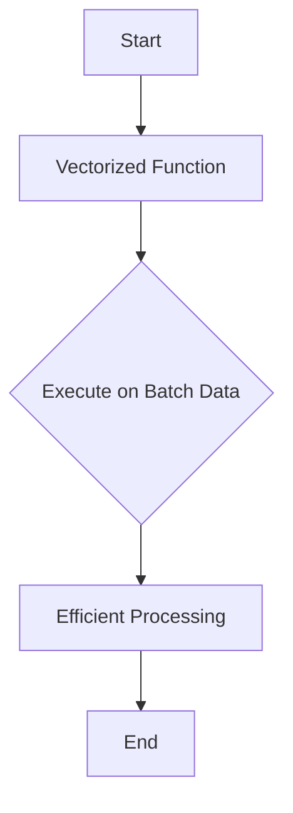

import { Callout, Steps, Step } from "nextra-theme-docs";

# JAX and High-Performance Computing

In leveraging JAX for our project, we harness the power of high-performance computing to create efficient, scalable trading strategies. This section provides an overview of how JAX's capabilities enhance our trading strategy project, focusing on **Just-In-Time (JIT) Compilation**, **Automatic Differentiation**, and **Vectorization**. These are critical to ensure that our algorithms run swiftly and accurately, processing extensive financial data with ease.

## Just-In-Time (JIT) Compilation

JIT compilation in JAX is a transformative feature that significantly boosts the performance of Python code. By compiling functions into optimized machine code right before execution, JIT minimizes execution time and maximizes resource utilization. Here's how we use it in our workflows:

### How JIT Compilation Works

JIT compilation allows functions to be transformed into an efficient form in a single step:

<Steps>

### Step 1

Identify computationally intensive functions suitable for optimization, such as those performing mathematical operations on large arrays.

### Step 2

Decorate these functions with `@jax.jit`, prompting JAX to compile them just-in-time.

### Step 3

Upon first execution, the function compiles and executes, and subsequent calls use the compiled version, reducing future overhead.

</Steps>

```python
import jax
import jax.numpy as jnp

@jax.jit
def compute_strategy(array):
    return jnp.dot(array, array.T)
```

> **Note**: Use JIT with statically shaped inputs to ensure performance gains and avoid recompilation.

## Automatic Differentiation

Automatic differentiation, or autodiff, is essential in optimizing our machine learning models within trading strategies. It involves computing derivatives accurately and efficiently, crucial for backpropagation in neural networks or optimizing financial models.

### Benefits of Autodiff

- **Precision**: Offers high precision by avoiding numerical approximations.
- **Efficiency**: Computes gradients efficiently, even for complex models.
  
**Example**: Consider a simple derivative using JAX's `grad` function.

```python
def trading_loss(weights):
    return jnp.sum(weights ** 2)

gradient_fn = jax.grad(trading_loss)
gradient = gradient_fn(jnp.array([1.0, 2.0, 3.0]))
```

<Callout>Autodiff is pivotal in refining trading models, enabling dynamic adjustment based on loss gradient calculations.</Callout>

## Vectorization

Vectorization with JAX's `vmap` function allows parallelizing operations over batch dimensions without explicit loops, optimizing both speed and code clarity. This ensures our trading models efficiently process large datasets across batches.

### Vectorization in Action

Imagine applying a function across a batch of input data:

```python
def trading_function(x):
    return jnp.sum(x ** 2)

# Vectorized application
batched_function = jax.vmap(trading_function)
result = batched_function(jnp.array([[1, 2, 3], [4, 5, 6]]))
```



## Conclusion

Employing JAX's high-performance computing features like JIT compilation, automatic differentiation, and vectorization, we achieve a robust and agile trading strategy framework. These capabilities not only optimize our processing power but also ensure that our models are both responsive and adaptable to the rapid changes in financial markets.

For further insights into integrating JAX with machine learning models, see the [Machine Learning Models](/project-architecture/machine-learning-models) section. Explore more architectural elements in our broader [Project Architecture](/project-architecture) overview.