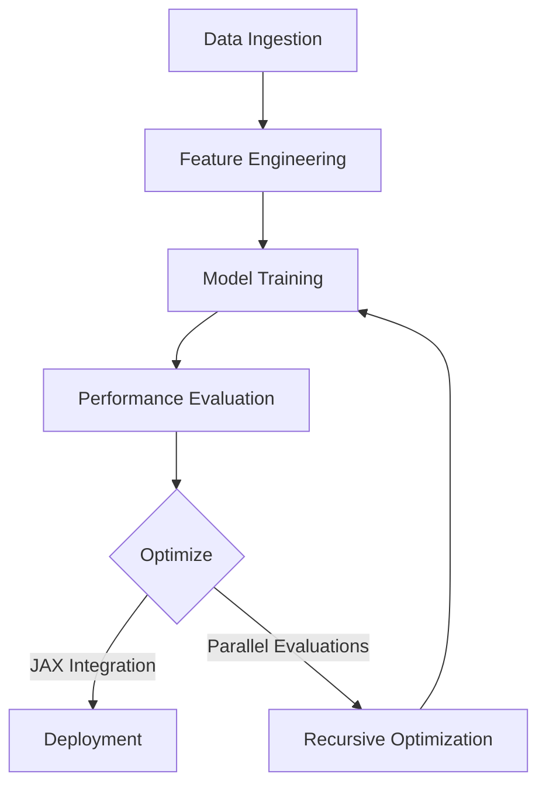

# Machine Learning Models

The **Machine Learning Models** component is a crucial part of the StratOptimus-TradingWizard project's architecture. It plays a significant role in predictive analytics, trend analysis, and optimization of trading parameters. Below, we explore the key aspects of these models and how they integrate into the project's architecture.

## Overview

Machine learning models serve as the engine powering many of the project's predictive functionalities. By learning from historical and real-time financial data, these models can identify patterns, predict market trends, and inform trading decisions with high accuracy.

<Callout>
**Why Machine Learning?**
Machine learning models are uniquely suited to handle the vast amounts of data and complexity involved in financial markets, making them indispensable for developing sophisticated trading strategies.
</Callout>

## Types of Models Used

A variety of machine learning models are utilized, each suited to different types of predictive tasks:

- **Linear Regression Models:** Used for predicting continuous variables, such as asset prices, based on a set of explanatory variables.
- **Decision Trees:** Serve both as a stand-alone model and as a building block for more complex ensemble methods like Random Forests.
- **Neural Networks:** Particularly deep learning models, useful for capturing non-linear relationships in large datasets.
- **Clustering Algorithms:** Assist in market segmentation and identifying trends by grouping similar data points.

## Model Training and Optimization

Training machine learning models involves feeding them with data and allowing them to learn the relationships between inputs and outputs. This process is augmented with techniques such as:

- **Backtesting**: Evaluating model performance using historical data to simulate how strategies would have performed in the past.
- **Parameter Tuning**: Adjusting model hyperparameters to improve performance. Common techniques include grid search and random search.
- **Cross-Validation**: Splitting data into multiple parts to validate the model's ability to generalize to new data.

### Steps in Model Training

<Steps>
### Step 1: Data Preparation

- **Data Cleaning**: Remove outliers and normalize data for consistency.
- **Feature Engineering**: Create new predictive features based on domain knowledge.

### Step 2: Model Selection

- **Choose Algorithms**: Select appropriate models based on the problem type and data characteristics.

### Step 3: Training

- **Fit Models**: Use algorithms to learn from training data.

### Step 4: Evaluation

- **Assess Performance**: Use metrics like RMSE (Root Mean Square Error), accuracy, and precision to evaluate models.
</Steps>

## Integration with JAX and HPC

JAX is crucial for optimizing machine learning models in this project. Its capabilities for:

- **Automatic Differentiation**: Critical for training deep learning models using gradient descent.
- **Just-In-Time Compilation**: Enhances performance by compiling Python code into efficient machine code, reducing latency.
- **Parallel Evaluations**: Leveraging JAX's parallelism features to perform simultaneous evaluations of multiple trading strategies, thereby speeding up the optimization process.

Additionally, the integration with High-Performance Computing (HPC) allows the project to handle large datasets and complex models efficiently, ensuring scalability and robustness in trading strategy optimization.

## Recursive Optimization Workflow

The **Recursive Optimization** workflow leverages JAX's capabilities to iteratively refine trading strategy parameters. By performing parallel evaluations and utilizing just-in-time compilation, the optimization process becomes significantly faster and more efficient. This approach allows for more extensive parameter searches within the same time frame, leading to better-performing trading strategies.

### Key Components:

- **StrategyParameters**: Defines the configurable parameters of the trading strategy, such as take profit, stop loss, and MACD signals.
- **BacktestResult**: Captures the performance metrics of a strategy, including total return, Sharpe ratio, and maximum drawdown.
- **Recursive Optimization Function**: Iteratively adjusts strategy parameters based on backtest results to find the optimal configuration.

### Example Workflow:

1. **Initialize Parameters**: Start with a set of initial strategy parameters.
2. **Optimize Parameters**: Use JAX to perform parallel evaluations of different parameter sets.
3. **Evaluate Performance**: Backtest each parameter set and record performance metrics.
4. **Refine Parameters**: Based on the results, adjust the parameters and repeat the optimization process.
5. **Finalize Strategy**: Select the parameter set with the best performance metrics for deployment.

## Conclusion

Machine learning models are at the heart of the StratOptimus-TradingWizard project, providing the predictive power required for effective trading strategies. By leveraging advanced techniques and tools like JAX, the project ensures that these models are not only accurate but also scalable and efficient.

The integration of JAX with High-Performance Computing further enhances the performance and scalability of the machine learning models, enabling the project to handle large datasets and complex computations with ease. The recursive optimization workflow exemplifies how JAX's parallelism and just-in-time compilation can be utilized to achieve superior optimization results in trading strategy development.

For more detailed insights, refer to the [Project Architecture](/project-architecture) section and explore subsections such as [JAX and High-Performance Computing](/project-architecture/jax-high-performance-computing).
