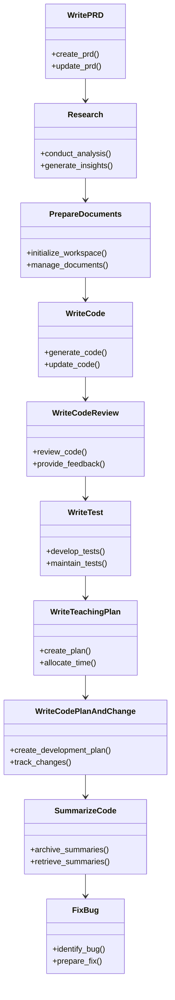
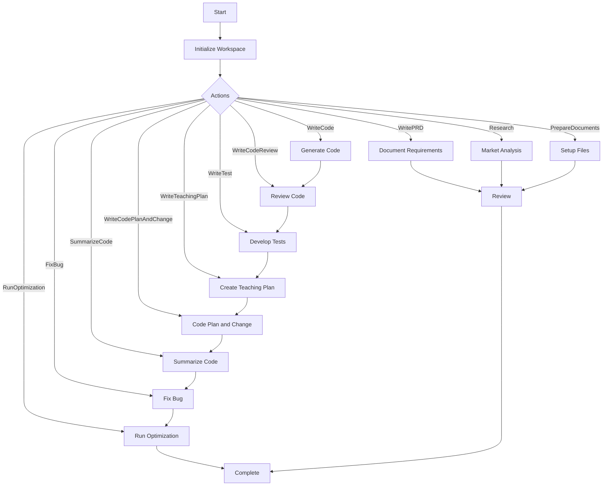

# MetaGPT Framework Integration

The **MetaGPT Framework** plays a pivotal role in the **StratOptimus-TradingWizard** project by providing a robust foundation for workflow automation and intelligent decision-making. By utilizing MetaGPT, the project is able to streamline processes such as strategy development, testing, optimization, and project management, which enhances productivity and reduces manual workload.

## Core Functions of MetaGPT

The MetaGPT framework harnesses the power of artificial intelligence to manage and automate complex workflows. Here’s a breakdown of its core functions:

- **Custom Actions**: MetaGPT defines specific tasks as actions, allowing automation of routine processes, such as code writing, strategy assessment, parameter optimization, and project management.
- **Intelligent Prompts**: Utilizes carefully crafted prompts to guide AI in executing complex tasks accurately, ensuring consistent and high-quality outputs.
- **Workflow Orchestration**: Coordinates the sequence and execution of various actions, ensuring that all project phases are executed efficiently.

<Callout>
MetaGPT automates critical tasks in the StratOptimus-TradingWizard project, thus accelerating development and enhancing strategy precision.
</Callout>

## Action Definitions

Actions are the fundamental units of automation within MetaGPT. They encapsulate specific tasks and operations necessary for developing and optimizing the trading strategy.

### Examples of Actions

Here are a few examples of the actions defined in the project:

- **WritePRD**: Manages the creation and updating of Product Requirement Documents. For details on PRD management, see [Documentation and User Guides](/documentation-user-guides).
- **Research**: Conducts in-depth analysis of trading strategies and market dynamics, using data to inform decision-making.
- **PrepareDocuments**: Sets up the project workspace, initializes necessary files, and manages document updates.
- **WriteCode**: Automates the process of writing and updating code based on design specifications and requirements.
- **WriteCodeReview**: Conducts thorough code reviews, providing constructive feedback and actionable suggestions for improvements.
- **WriteTest**: Develops and maintains automated test suites to validate the reliability and performance of trading algorithms.
- **WriteTeachingPlan**: Creates detailed teaching plans, including time allocations, teaching methods, vocabulary exercises, and grammar questions.
- **WriteCodePlanAndChange**: Crafts incremental development plans and tracks code changes in a structured format.
- **SummarizeCode**: Archives summarization content of issue discoveries for use in code writing and review.
- **FixBug**: Handles bug fixing processes without specific implementation details, preparing the groundwork for detailed bug resolution.



## Intelligent Prompts

MetaGPT employs intelligent prompts to direct the AI across various actions and workflows. These prompts ensure that the AI executes tasks with precision, improving the overall accuracy of the project outcomes.

- **Optimization Prompts**: Guide the AI in refining trading parameters based on historical performance data.
- **Evaluation Prompts**: Assist in the assessment of strategy effectiveness, focusing on metrics such as total return and Sharpe ratio.
- **Code Generation Prompts**: Direct the AI to write and update code in line with design specifications and requirements.
- **Code Review Prompts**: Facilitate thorough code reviews, ensuring compliance with best practices and design standards.
- **Testing Prompts**: Aid in the creation of comprehensive test suites to validate trading strategies.
- **Project Management Prompts**: Streamline project management tasks, including task listing, requirement prioritization, and dependency management.

<Steps>
### Step 1

Define precise objectives for each action using clear and structured prompts.

### Step 2

Implement prompts to guide AI in executing tasks efficiently, reducing the need for manual intervention.
</Steps>

## Workflow Orchestration

MetaGPT orchestrates workflows by coordinating the interactions between different actions. This ensures that tasks are executed in a logical and efficient sequence, promoting consistency and reducing errors.

### Initial Strategy Development

Establishes the foundational trading strategy from requirements and initial designs. This involves actions such as **WritePRD**, **Research**, and **PrepareDocuments** to create a solid foundation for further optimization.

### Incremental Improvements

Refines and optimizes the strategy through iterative testing and feedback using actions like **WriteCode**, **WriteCodeReview**, **WriteTest**, and **WriteCodePlanAndChange**. This phase ensures that the strategy evolves based on performance metrics and real-world feedback.

### Trading Strategy Optimization

Integrates advanced workflows for trading strategy optimization, leveraging actions like **SummarizeCode**, **FixBug**, and specialized workflows like **TradingWorkflow** to ensure the strategy is both effective and maintainable.



### Trading Workflow Integration

The **TradingWorkflow** is a specialized workflow within MetaGPT that focuses on optimizing trading strategies. It leverages advanced actions and integrations to ensure that trading parameters are finely tuned and that strategies perform optimally in various market conditions.

- **Parameter Optimization**: Uses actions like **WriteCodePlanAndChange** and **Research** to iteratively refine trading parameters.
- **Strategy Evaluation**: Implements actions such as **WriteTest** and **WriteCodeReview** to assess the effectiveness of trading strategies.
- **Recursive Optimization**: Utilizes scripts like `run_optimization.py` to perform recursive optimization of trading strategies, leveraging MetaGPT actions for automated parameter adjustments and performance evaluations.
- **Cost Management**: Integrates cost tracking through the **CostManager** to monitor and optimize resource usage during strategy optimization.

<Callout>
The **TradingWorkflow** ensures that trading strategies are continuously refined and optimized, leveraging MetaGPT's automation capabilities to achieve high performance and reliability.
</Callout>

## Integration with Scripts

MetaGPT seamlessly integrates with various scripts and modules within the project to facilitate comprehensive workflow automation.

### Example Integrations

- **run_optimization.py**: Utilizes MetaGPT actions to load configurations, initialize LLM instances, execute recursive optimization, and handle logging.
  
  ```python
  ```python:Trading/run_optimization.py
  import asyncio
  import logging
  from typing import Dict, Any
  import os
  import json
  from datetime import datetime
  import sys
  import vectorbtpro as vbt
  from metagpt.configs.llm_config import LLMConfig
  from metagpt.configs.llm_config import LLMConfig
  # Add the project root directory to sys.path
  project_root = os.path.abspath(os.path.join(os.path.dirname(__file__), "..", "..", ".."))
  sys.path.insert(0, project_root)
  sys.path.insert(0, project_root)
  from scripts.config_utils import load_config
  from metagpt.provider.llm_provider_registry import create_llm_instance
  from scripts.optimized.Trading.recursive_optimization import recursive_optimization
  from scripts.optimized.Trading.backtester_module import load_trade_data  # Corrected import path
  from scripts.optimized.Trading.backtester_module import load_trade_data  # Corrected import path
  # Set up logging
  logging.basicConfig(level=logging.INFO, format='%(asctime)s - %(levelname)s - %(message)s')
  logger = logging.getLogger(__name__)
  from dotenv import load_dotenv
  
  # Load environment variables from .env file
  load_dotenv()
  
  async def main():
      try:
          # Load configuration
          config = load_config(os.environ.get("TRADING_CONFIG_PATH", "config/trading_config.yaml"))
          
          # Create LLM instance
          llm_config = LLMConfig(**config["llm_config"])
          llm = create_llm_instance(llm_config)
  
          # Create output directory
          timestamp = datetime.now().strftime("%Y%m%d_%H%M%S")
          output_dir = f"output/trading_optimization_{timestamp}"
          os.makedirs(output_dir, exist_ok=True)
          
          # Load dataset
          dataset = config.get("dataset", [])  # Assuming dataset is defined in the config
          
          # Define initial parameters
          initial_params = config.get("initial_params", {
              "take_profit": 0.08,
              "stop_loss": 0.12,
              "sl_window": 400,
              "max_orders": 3,
              "post_buy_delay": 2,
              "post_sell_delay": 5,
              "macd_signal_fast": 120,
              "macd_signal_slow": 260,
              "macd_signal_signal": 90,
              "min_macd_signal_threshold": 0.0,
              "max_macd_signal_threshold": 0.0,
              "enable_sl_mod": False,
              "enable_tp_mod": False,
              "ma_window": 20,
              "fees": 0.001  # Add this line
          })
          
          # Load or fetch trading data using the backtester's load_trade_data function
          trading_data = load_trade_data("big_optimize_1016.pkl")
  
          if trading_data is None:
              logger.error("Failed to load trading data. Please ensure the pickle file exists and is accessible.")
              return
  
          # Create a dataset with a subset of assets for optimization
          dataset = list(trading_data.keys())[:5]  # Use the first 5 assets for example
          
          # Run recursive optimization
          best_strategy, best_performance = await recursive_optimization(
              initial_params=initial_params,
              dataset=dataset,
              llm=llm,
              trading_data=trading_data,
              max_iterations=config.get("max_rounds", 45),
              convergence_threshold=config.get("convergence_threshold", 0.01),
              parallel_evaluations=config.get("parallel_evaluations", 5)  # Added parallel_evaluations parameter
          )
  
          # Save the best strategy
          if best_strategy:
              with open(os.path.join(output_dir, "best_trading_strategy_final.json"), "w") as f:
                  json.dump(best_strategy, f, indent=2)
              logger.info(f"Optimization completed. Best strategy saved to {output_dir}")
              logger.info(f"Best performance: {best_performance}")
          else:
              logger.error("Optimization failed.")
  
      except Exception as e:
          logger.error(f"An error occurred: {str(e)}")
          raise
  
  if __name__ == "__main__":
      asyncio.run(main())
  ```
  ```

- **graph.py**: Defines the workflow classes, including **Workflow** and **TradingWorkflow**, which interact with MetaGPT actions to manage trading strategy optimization processes.
  
  ```python
  ```python:Trading/workflows/round_1/graph.py
  # -*- coding: utf-8 -*-
  # @Date    : 10/04/2024 10:00 AM
  # @Author  : issac
  # @Desc    : Workflow Classes for Trading Strategy Optimization
  
  from typing import Literal, Dict, Any, Tuple, List
  from pydantic import BaseModel, Field
  from metagpt.provider.llm_provider_registry import create_llm_instance
  from metagpt.utils.cost_manager import CostManager
  import sys
  import os
  import asyncio
  import json
  import vectorbtpro as vbt
  
  # Add the project root directory to sys.path
  project_root = os.path.abspath(os.path.join(os.path.dirname(__file__), "..", "..", ".."))
  sys.path.insert(0, project_root)
  
  import scripts.optimized.Trading.workflows.template.operator as operator
  import scripts.optimized.Trading.workflows.round_1.prompt as prompt_custom
  from scripts.optimized.Trading.workflows.template.operator import (
      get_parameter_optimizer,
      get_strategy_evaluator
  )
  
  # Import the logging module and configure logging
  import logging
  import traceback
  
  # Set up logging configuration
  logging.basicConfig(
      level=logging.DEBUG,  # Set to DEBUG to capture all levels of logs
      format="%(asctime)s - %(name)s - %(levelname)s - %(message)s",
      handlers=[
          logging.FileHandler("workflow_errors.log"),
          logging.StreamHandler(sys.stdout)
      ]
  )
  logger = logging.getLogger(__name__)
  
  # Define Pydantic models for operator responses
  class StrategyParameters(BaseModel):
      take_profit: float = Field(default=0.08, description="Take profit percentage")
      stop_loss: float = Field(default=0.12, description="Stop loss percentage")
      sl_window: int = Field(default=400, description="Stop loss window")
      max_orders: int = Field(default=3, description="Maximum number of concurrent orders")
      order_size: float = Field(default=0.0025, description="Order size as a ratio of SOL pool")
      post_buy_delay: int = Field(default=2, description="Delay after a buy order")
      post_sell_delay: int = Field(default=5, description="Delay after a sell order")
      macd_signal_fast: int = Field(default=120, description="MACD fast period")
      macd_signal_slow: int = Field(default=260, description="MACD slow period")
      macd_signal_signal: int = Field(default=90, description="MACD signal period")
      min_macd_signal_threshold: float = Field(default=0.0, description="Minimum MACD signal threshold")
      max_macd_signal_threshold: float = Field(default=0.0, description="Maximum MACD signal threshold")
      enable_sl_mod: bool = Field(default=False, description="Enable stop loss modification")
      enable_tp_mod: bool = Field(default=False, description="Enable take profit modification")
  
  class BacktestResult(BaseModel):
      total_return: float = Field(default=0.0, description="Total return of the strategy")
      sharpe_ratio: float = Field(default=0.0, description="Sharpe ratio of the strategy")
      max_drawdown: float = Field(default=0.0, description="Maximum drawdown of the strategy")
  
  DatasetType = Literal["HumanEval", "MBPP", "GSM8K", "MATH", "HotpotQA", "DROP", "Trading"]
  
  class Workflow:
      def __init__(
          self,
          name: str,
          llm: Any,
          dataset: DatasetType,
      ) -> None:
          self.name = name
          self.dataset = dataset
          self.llm = llm
          self.llm.cost_manager = CostManager()
          self.custom = operator.Custom(self.llm)
  
      async def __call__(self, problem: str) -> Tuple[str, float]:
          """
          Implementation of the basic workflow
  
          Args:
              problem (str): The input problem to solve.
  
          Returns:
              Tuple[str, float]: The solution and the total cost.
          """
          solution = await self.custom(input=problem, instruction="")
          return solution['response'], self.llm.cost_manager.total_cost
  
  class TradingWorkflow(Workflow):
      def __init__(
          self,
          name: str,
          llm: Any,
          dataset: DatasetType,
          trading_data: vbt.Portfolio
      ) -> None:
          super().__init__(name, llm, dataset)
          self.trading_data = trading_data
          self.parameter_optimizer = get_parameter_optimizer(self.llm)
          self.strategy_evaluator = get_strategy_evaluator(self.llm)
  
      async def execute_trading_workflow(
          self, initial_parameters: StrategyParameters
      ) -> Tuple[Dict[str, Any], float]:
          """
          Executes the trading strategy optimization workflow.
  
          Args:
              initial_parameters (StrategyParameters): The initial parameters for the trading strategy.
  
          Returns:
              Tuple[Dict[str, Any], float]: Evaluation results and total cost.
          """
          try:
              # Step 1: Optimize parameters
              optimized_params_response = await self.parameter_optimizer(
                  initial_parameters=initial_parameters.dict(),
                  trading_data=self.trading_data,
                  instruction=prompt_custom.PARAMETER_OPTIMIZATION_PROMPT
              )
              logger.debug(f"Optimized parameters response: {optimized_params_response}")
              optimized_params = StrategyParameters(**self._ensure_dict(optimized_params_response))
              logger.debug(f"Parsed optimized parameters: {optimized_params}")
  
              # Step 2: Evaluate strategy
              backtest_result_response = await self.strategy_evaluator(
                  parameters=optimized_params.dict(),
                  trading_data=self.trading_data,
                  instruction=prompt_custom.STRATEGY_EVALUATION_PROMPT
              )
              logger.debug(f"Backtest result response: {backtest_result_response}")
              backtest_result = BacktestResult(**self._ensure_dict(backtest_result_response))
              logger.debug(f"Parsed backtest result: {backtest_result}")
  
              evaluation_results = {
                  "optimized_parameters": optimized_params.dict(),
                  "backtest_results": backtest_result.dict()
              }
  
              logger.debug(f"Evaluation results: {evaluation_results}")
  
              return evaluation_results, self.llm.cost_manager.total_cost
          except Exception as e:
              logger.error(f"Error in execute_trading_workflow: {str(e)}")
              logger.error("Traceback:", exc_info=True)
              return {"error": str(e)}, 0.0
  
      async def __call__(self, initial_parameters: StrategyParameters) -> Tuple[Dict[str, Any], float]:
          """
          Overrides the basic workflow call method to execute the trading workflow.
  
          Args:
              initial_parameters (StrategyParameters): The initial parameters for the trading strategy.
  
          Returns:
              Tuple[Dict[str, Any], float]: Evaluation results and total cost.
          """
          return await self.execute_trading_workflow(initial_parameters)
  
      def _ensure_dict(self, obj: Any) -> Dict[str, Any]:
          """
          Ensures that the provided object is a dictionary.
          If it's a Pydantic model, convert it to a dict.
          If it's a list, convert each element.
          Otherwise, convert the object to a string.
  
          Args:
              obj (Any): The object to ensure is a dictionary.
  
          Returns:
              Dict[str, Any]: The standardized dictionary.
          """
          if isinstance(obj, dict):
              return {k: self._ensure_serializable(v) for k, v in obj.items()}
          elif hasattr(obj, 'dict'):
              return {k: self._ensure_serializable(v) for k, v in obj.dict().items()}
          elif isinstance(obj, list):
              return {f"item_{i}": self._ensure_serializable(item) for i, item in enumerate(obj)}
          else:
              return {"value": str(obj)}
  
      def _ensure_serializable(self, obj: Any) -> Any:
          """
          Recursively ensures that an object is JSON serializable.
          Converts non-serializable objects to strings.
  
          Args:
              obj (Any): The object to serialize.
  
          Returns:
              Any: The JSON serializable object.
          """
          if isinstance(obj, (str, int, float, bool, type(None))):
              return obj
          elif isinstance(obj, dict):
              return self._ensure_dict(obj)
          elif isinstance(obj, list):
              return [self._ensure_serializable(item) for item in obj]
          else:
              return str(obj)
  
  # Example usage
  if __name__ == "__main__":
      llm_config = {
          "model": "gpt-4",
          "api_key": "your-api-key-here"
      }
  
      # Initialize LLM instance
      llm = create_llm_instance(llm_config)
  
      # Load trading data (ensure the path is correct)
      trading_data = vbt.Portfolio.from_pickle("path/to/your/trading_data.pickle")
  
      # Initialize TradingWorkflow
      trading_workflow = TradingWorkflow(
          name="TradingStrategyOptimization",
          llm=llm,
          dataset="Trading",
          trading_data=trading_data
      )
  
      # Define initial strategy parameters
      initial_params = StrategyParameters(
          take_profit=0.05,
          stop_loss=0.03,
          sl_window=400,
          max_orders=3,
          post_buy_delay=2,
          post_sell_delay=5,
          macd_signal_fast=120,
          macd_signal_slow=260,
          macd_signal_signal=90,
          min_macd_signal_threshold=0.0,
          max_macd_signal_threshold=0.0,
          enable_sl_mod=False,
          enable_tp_mod=False
      )
  
      # Execute the workflow asynchronously
      async def execute_workflow():
          results, cost = await trading_workflow(initial_params)
          print(f"Optimization results: {results}")
          print(f"Total cost: {cost}")
  
      asyncio.run(execute_workflow())
  ```
  ```

## Enhanced Trading Workflow

The **TradingWorkflow** within MetaGPT is designed to optimize trading strategies through a structured and automated process. It leverages various actions and integrates seamlessly with scripts to ensure that trading parameters are finely tuned for optimal performance.

### Components of TradingWorkflow

- **StrategyParameters**: A Pydantic model defining the parameters for the trading strategy, such as `take_profit`, `stop_loss`, `macd_signal_fast`, etc.
- **BacktestResult**: A Pydantic model capturing the results of backtesting, including `total_return`, `sharpe_ratio`, and `max_drawdown`.
- **Parameter Optimizer**: Utilizes actions to optimize trading parameters based on historical data and performance metrics.
- **Strategy Evaluator**: Assesses the effectiveness of the optimized strategy through backtesting and performance analysis.
- **CostManager**: Tracks and manages the costs associated with using the LLM and executing workflows.

### Workflow Execution

1. **Initialization**: Loads configurations, initializes the LLM instance, and sets up logging.
2. **Data Loading**: Loads trading data necessary for backtesting and optimization.
3. **Parameter Optimization**: Executes the parameter optimizer to refine trading parameters.
4. **Strategy Evaluation**: Backtests the optimized parameters to evaluate strategy performance.
5. **Results Handling**: Saves the best-performing strategy and logs the outcomes.
6. **Error Handling**: Logs any errors encountered during the workflow execution for further analysis.

<Callout>
The **TradingWorkflow** ensures that trading strategies are continuously refined and optimized, leveraging MetaGPT's automation capabilities to achieve high performance and reliability.
</Callout>

## Best Practices

Integrating MetaGPT into the project's architecture adheres to several best practices to ensure maintainability, scalability, and efficiency:

- **Modular Design**: Organize code into well-defined modules and actions, facilitating reusability and ease of maintenance.
- **Descriptive Naming**: Use clear and descriptive names for variables, functions, and classes to enhance readability.
- **Error Handling**: Implement robust error handling and logging to aid in debugging and maintaining the workflow.
- **Performance Optimization**: Leverage MetaGPT's capabilities to optimize workflows for performance, including parallel evaluations and efficient resource management.
- **Documentation**: Maintain comprehensive documentation for actions, workflows, and integrations to support ongoing development and onboarding.

## Conclusion

Integrating the MetaGPT Framework in the StratOptimus-TradingWizard project significantly enhances workflow automation and task management. From the automation of repetitive actions to the coordination of complex workflows, MetaGPT is indispensable for achieving high efficiency and precision in trading strategy development.

For further details on core components and architecture, see [Project Architecture](/project-architecture) and explore more about [Actions](/key-functional-components/actions) as well as [Workflows](/key-functional-components/workflows).
