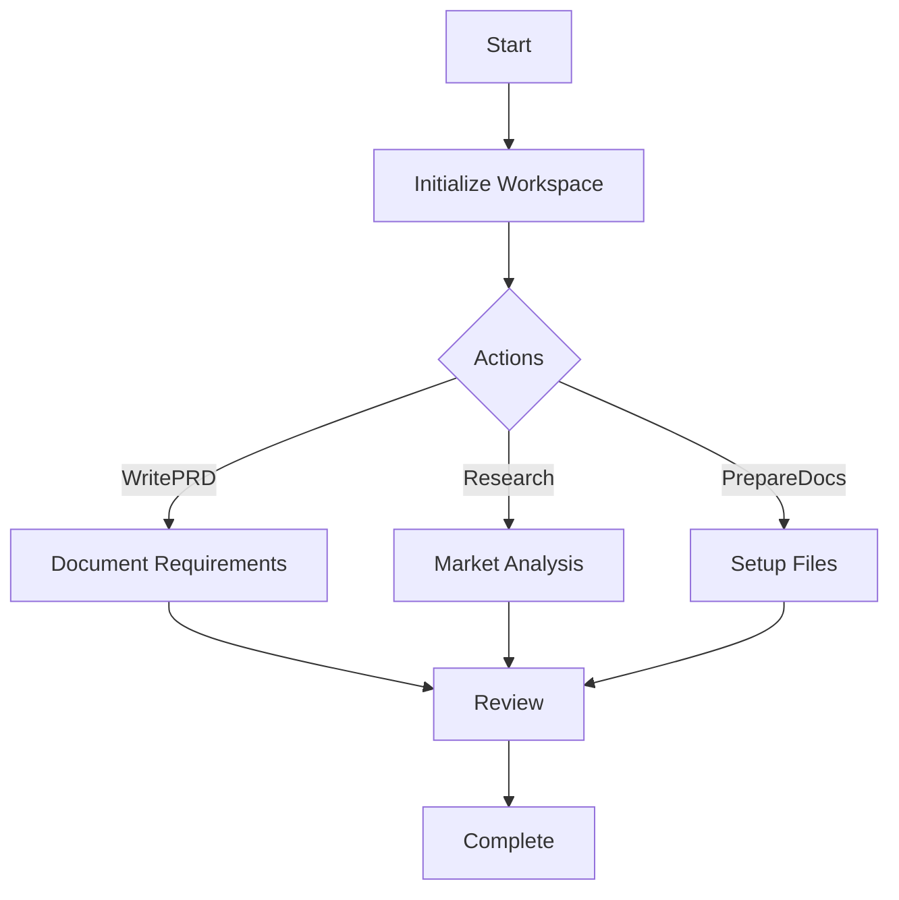

import { Callout, Steps, Step } from "nextra-theme-docs";

# MetaGPT Framework Integration

The **MetaGPT Framework** plays a pivotal role in the **StratOptimus-TradingWizard** project by providing a robust foundation for workflow automation and intelligent decision-making. By utilizing MetaGPT, the project is able to streamline processes such as strategy development, testing, and optimization, which enhances productivity and reduces manual workload.

## Core Functions of MetaGPT

The MetaGPT framework harnesses the power of artificial intelligence to manage and automate complex workflows. Here’s a breakdown of its core functions:

- **Custom Actions**: MetaGPT defines specific tasks as actions, allowing automation of routine processes, such as code writing, strategy assessment, and parameter optimization.
- **Intelligent Prompts**: Utilizes carefully crafted prompts to guide AI in executing complex tasks accurately, ensuring consistent and high-quality outputs.
- **Workflow Orchestration**: Coordinates the sequence and execution of various actions, ensuring that all project phases are executed efficiently.

<Callout>
MetaGPT automates critical tasks in the StratOptimus-TradingWizard project, thus accelerating development and enhancing strategy precision.
</Callout>

## Action Definitions

Actions are the fundamental units of automation within MetaGPT. They encapsulate specific tasks and operations necessary for developing and optimizing the trading strategy.

### Examples of Actions

Here are a few examples of the actions defined in the project:

- **WritePRD**: Manages the creation and updating of Product Requirement Documents. For details on PRD management, see [Documentation and User Guides](/documentation-user-guides).
- **Research**: Conducts in-depth analysis of trading strategies and market dynamics, using data to inform decision-making.
- **PrepareDocuments**: Sets up the project workspace, initializes necessary files, and manages document updates.

## Intelligent Prompts

MetaGPT employs intelligent prompts to direct the AI across various actions and workflows. These prompts ensure that the AI executes tasks with precision, improving the overall accuracy of the project outcomes.

- **Optimization Prompts**: Guide the AI in refining trading parameters based on historical performance data.
- **Evaluation Prompts**: Assist in the assessment of strategy effectiveness, focusing on metrics such as total return and Sharpe ratio.

<Steps>
### Step 1

Define precise objectives for each action using clear and structured prompts.

### Step 2

Implement prompts to guide AI in executing tasks efficiently, reducing the need for manual intervention.
</Steps>

## Workflow Orchestration

MetaGPT orchestrates workflows by coordinating the interactions between different actions. This ensures that tasks are executed in a logical and efficient sequence, promoting consistency and reducing errors.

- **Initial Strategy Development**: Establishes the foundational trading strategy from requirements and initial designs.
- **Incremental Improvements**: Refines and optimizes the strategy through iterative testing and feedback.

By allowing seamless coordination among diverse tasks, MetaGPT ensures that the [Project Architecture](/project-architecture) remains robust, scalable, and efficient.

## Conclusion

Integrating the MetaGPT Framework in the StratOptimus-TradingWizard project significantly enhances workflow automation and task management. From the automation of repetitive actions to the coordination of complex workflows, MetaGPT is indispensable for achieving high efficiency and precision in trading strategy development.

For further details on core components and architecture, see [Project Architecture](/project-architecture) and explore more about [Actions](/key-functional-components/actions) as well as [Workflows](/key-functional-components/workflows).