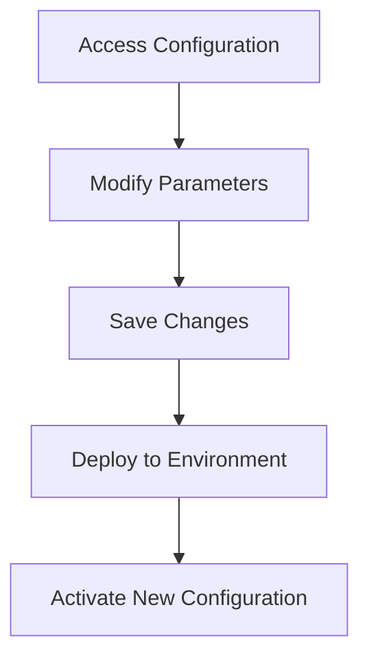

import { Callout, Steps, Step } from "nextra-theme-docs";

# Project Configuration

This section covers the configuration management of the **StratOptimus-TradingWizard** project, enabling flexibility and scalability across various environments. Configuration files play a crucial role in setting parameters and managing settings, ensuring that the project can adapt to different requirements seamlessly.

## Overview of Configuration Files

The project primarily utilizes JSON configuration files to manage its settings, providing an easy-to-read and modify format. These configuration files allow for centralized management of environment-specific settings, aiding in the deployment and seamless operation of the project.

**Key Configuration File:**

- `wizard.json`: This file contains parameters that control the model selection, console output settings, and various hyperparameters crucial for strategy development and execution.

### Configuration Structure

The `wizard.json` file is structured as follows:

```json
{
  "model_selection": "jax_model_v1",
  "console_output": "verbose",
  "learning_rate": 0.001,
  "weights": [0.1, 0.2, 0.3],
  "gradients": "auto"
}
```

### Configuration Settings

- **Model Selection:** Specifies the choice of machine learning models or configurations to be used. This enables quick switching between different models without altering the core code.
  
- **Console Output:** Controls the verbosity of console logs, allowing developers to toggle between detailed debugging information and streamlined output based on the task.

- **Learning Rate:** Defines the learning rate for training algorithms. It is crucial for convergence and stability in machine learning model training.

- **Weights and Gradients:** Manages the distribution of weights across strategy components, and uses automatic gradient calculations for optimization processes.

<Callout>
It's crucial to adjust these settings based on your specific requirements and the environment in which the project is deployed.
</Callout>

## Managing Environment-Specific Configurations

The project supports different configurations tailored to specific environments, such as development, testing, and production. This flexibility is achieved through merging configuration files or using environment variables to override default settings.

### Using Environment Variables

To enhance security and flexibility, certain configurations like API keys or database connections should be managed through environment variables. This ensures sensitive information is not stored directly in the codebase.

## Applying Configuration Changes

<Steps>
### Step 1: Access Configuration Files

Locate the configuration file `wizard.json` in the `config/` directory.

### Step 2: Modify Parameters

Edit the JSON file using any text editor. Adjust the parameters like `learning_rate`, `model_selection`, or add new ones as required for the new environment.

### Step 3: Save and Deploy

Save the changes and ensure they are committed to version control. Deploy the application to the target environment, and the new settings should take effect.
</Steps>

## Visualizing Configuration Management



## Example Application

When switching from a development to a production environment, you might change the `console_output` from `verbose` to `warning` to minimize logs and optimize performance.

```json
{
  "console_output": "warning"
}
```

By managing configurations this way, you ensure greater control and adaptability of the strategies and system behaviors, thereby contributing to the project's robustness and scalability.

## Conclusion

Efficient configuration management is vital in maintaining the adaptability and security of the **StratOptimus-TradingWizard** project. By effectively utilizing JSON files and environment variables, the project can seamlessly transition across different environments and requirements. For more on flexibility and adaptability in our project structure, refer to [Project Architecture](/project-architecture).