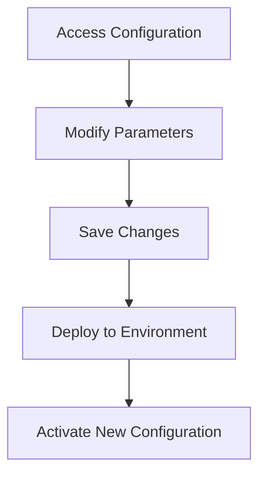

# Project Configuration

This section covers the configuration management of the **StratOptimus-TradingWizard** project, enabling flexibility and scalability across various environments. Configuration files play a crucial role in setting parameters and managing settings, ensuring that the project can adapt to different requirements seamlessly.

## Overview of Configuration Files

The project primarily utilizes YAML configuration files to manage its settings, providing an easy-to-read and modify format. These configuration files allow for centralized management of environment-specific settings, aiding in the deployment and seamless operation of the project.

**Key Configuration File:**

- `trading_config.yaml`: This file contains parameters that control the initial trading strategy parameters, LLM configurations, and various settings crucial for strategy development and execution.

### Configuration Structure

The `trading_config.yaml` file is structured as follows:

```yaml
trading_data_path: "trading_data/trading_data.pickle"
sample: 35
check_convergence: true
initial_round: 1
max_rounds: 45

initial_params:
  take_profit: 0.08
  stop_loss: 0.12
  sl_window: 400
  max_orders: 3
  post_buy_delay: 2
  post_sell_delay: 5
  macd_signal_fast: 120
  macd_signal_slow: 260
  macd_signal_signal: 90
  min_macd_signal_threshold: 0.0
  max_macd_signal_threshold: 0.0
  enable_sl_mod: false
  enable_tp_mod: false
  ma_window: 20
  fees: 0.001

llm_config:
  model: "gpt-4-turbo"
  api_type: "openai"
  base_url: "https://api.openai.com/v1"
  api_key: "your-api-key-here"
  temperature: 0

opt_llm_config:
  model: "gpt-4-turbo"
  api_type: "openai"
  base_url: "https://api.openai.com/v1"
  api_key: "your-api-key-here"
  temperature: 0

exec_llm_config:
  model: "gpt-3.5-turbo"
  api_type: "openai"
  base_url: "https://api.openai.com/v1"
  api_key: "your-api-key-here"
  temperature: 0
```

### Configuration Settings

- **Trading Data Path:** Specifies the location of the trading data file.
- **Sample Size:** Defines the number of samples to use in the optimization process.
- **Convergence Check:** Determines whether to check for convergence during optimization.
- **Initial Round and Max Rounds:** Controls the starting point and maximum number of optimization rounds.
- **Initial Parameters:** Sets the initial values for various trading strategy parameters.
- **LLM Configurations:** Manages the settings for different language models used in the optimization process.

<Callout>
It's crucial to adjust these settings based on your specific requirements and the environment in which the project is deployed.
</Callout>

## Managing Environment-Specific Configurations

The project supports different configurations tailored to specific environments, such as development, testing, and production. This flexibility is achieved through environment variables:

```python
# Load environment variables from .env file
from dotenv import load_dotenv
load_dotenv()

async def main():
    try:
        # Load configuration
        config = load_config(os.environ.get("TRADING_CONFIG_PATH", "config/trading_config.yaml"))
        ...
```

### Using Environment Variables

To enhance security and flexibility, certain configurations like API keys or database connections should be managed through environment variables. This ensures sensitive information is not stored directly in the codebase.

## Applying Configuration Changes

<Steps>
### Step 1: Access Configuration Files

Locate the configuration file `trading_config.yaml` in the `config/` directory.

### Step 2: Modify Parameters

Edit the YAML file using any text editor. Adjust the parameters like `learning_rate`, `model_selection`, or add new ones as required for the new environment.

### Step 3: Save and Deploy

Save the changes and ensure they are committed to version control. Deploy the application to the target environment, and the new settings should take effect.
</Steps>

## Visualizing Configuration Management



## Example Application

When switching from a development to a production environment, you might change the `max_rounds` or adjust the `llm_config` settings to optimize performance.

```yaml
max_rounds: 100

llm_config:
  model: "gpt-4-turbo-production"
  temperature: 0.1
```

By managing configurations this way, you ensure greater control and adaptability of the strategies and system behaviors, thereby contributing to the project's robustness and scalability.

## Conclusion

Efficient configuration management is vital in maintaining the adaptability and security of the **StratOptimus-TradingWizard** project. By effectively utilizing YAML files and environment variables, the project can seamlessly transition across different environments and requirements. For more on flexibility and adaptability in our project structure, refer to [Project Architecture](/project-architecture).
```
